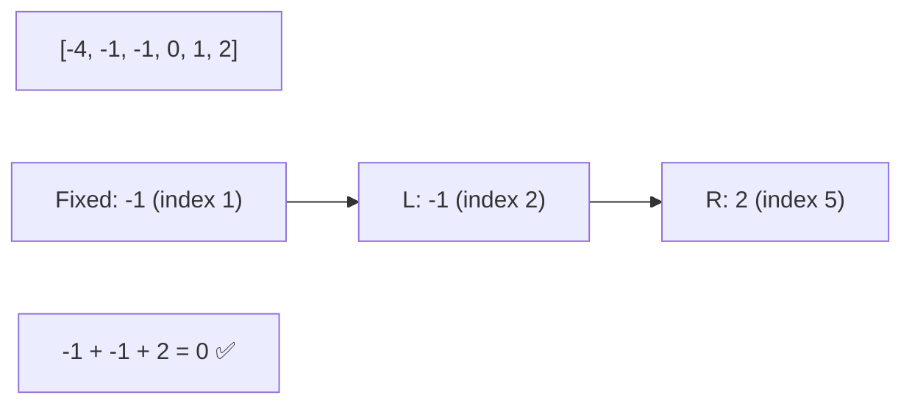

# 3️⃣ Two Pointers: 3Sum

## 📝 Problem Description
Given an integer array `nums`, return all the triplets `[nums[i], nums[j], nums[k]]` such that `i != j`, `i != k`, and `j != k`, and `nums[i] + nums[j] + nums[k] == 0`. Notice that the solution set must not contain duplicate triplets.

!!! info "Real-World Application"
    Used in recommendation systems to find combinations of three items that meet a specific budget or constraint, or in computer graphics for finding triplets of collinear points.

## 🛠️ Constraints & Edge Cases
- $3 \le nums.length \le 3000$
- $-10^5 \le nums[i] \le 10^5$
- **Edge Cases to Watch:**
    - Array with all zeros.
    - No triplets sum to zero.
    - Many duplicate values leading to duplicate triplets.

---

## 🧠 Approach & Intuition

!!! success "The Aha! Moment"
    Sort the array first. Then, iterate through each number and treat it as a "fixed" first element. For each fixed element, use the **Two Sum II (Two Pointers)** technique on the remaining part of the array to find the other two elements.

### 🐢 Brute Force (Naive)
Use three nested loops to check every possible triplet. This results in $O(N^3)$ time complexity, which is too slow for $N=3000$.

### 🐇 Optimal Approach
1. Sort the input array.
2. Iterate through the array. For each element `nums[i]`:
    - If `nums[i]` is the same as the previous element, skip it to avoid duplicate triplets.
    - Initialize two pointers: `l` at `i + 1` and `r` at the end of the array.
    - While `l < r`:
        - Calculate the sum `s = nums[i] + nums[l] + nums[r]`.
        - If `s < 0`, move `l` to the right.
        - If `s > 0`, move `r` to the left.
        - If `s == 0`, add the triplet to the result, and move `l` to the right, skipping any duplicate values.

### 🧩 Visual Tracing


---

## 💻 Solution Implementation

```python
(Implementation details need to be added...)
```

### ⏱️ Complexity Analysis
- **Time Complexity:** $\mathcal{O}(N^2)$ — We sort the array ($O(N \log N)$) and then iterate through the array once, with a nested two-pointer pass ($O(N)$) for each element.
- **Space Complexity:** $\mathcal{O}(1)$ or $\mathcal{O}(N)$ — Depending on the sorting algorithm implementation and whether the output array is counted.

---

## 🎤 Interview Toolkit

- **Duplicate Handling:** The most common mistake is forgetting to skip duplicates for the fixed element OR for the pointers after finding a valid triplet.
- **Follow-up:** How would you solve 4Sum? (Fix two elements and use Two Pointers for the remaining two, resulting in $O(N^3)$).

## 🔗 Related Problems
- [Two Sum II](../two_sum_ii/PROBLEM.md)
