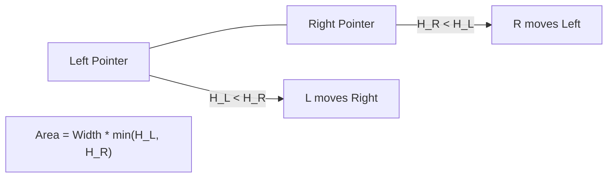

# 💧 Two Pointers: Container With Most Water

## 📝 Problem Description
You are given an integer array `height` of length `n`. There are `n` vertical lines drawn such that the two endpoints of the `i`th line are `(i, 0)` and `(i, height[i])`. Find two lines that together with the x-axis form a container, such that the container contains the most water.

!!! info "Real-World Application"
    Optimizing storage capacity in resource allocation problems, or in signal processing to find the most significant "energy" window between two peaks in a dataset.

## 🛠️ Constraints & Edge Cases
- $n == height.length$
- $2 \le n \le 10^5$
- $0 \le height[i] \le 10^4$
- **Edge Cases to Watch:**
    - Only two lines (minimum possible width).
    - All lines have the same height.
    - Heights are strictly increasing or decreasing.

---

## 🧠 Approach & Intuition

!!! success "The Aha! Moment"
    Start with the maximum possible width (pointers at both ends). To find a larger area, we **must** find a taller line to compensate for the shrinking width. Therefore, we should always move the pointer pointing to the **shorter line** inward.

### 🐢 Brute Force (Naive)
Calculate the area for every possible pair of lines. This results in $O(N^2)$ time complexity, which is too slow for $N=10^5$.

### 🐇 Optimal Approach
1. Initialize two pointers: `l` at the start (0) and `r` at the end (`n - 1`).
2. While `l < r`:
    - Calculate the current area: `(r - l) * min(height[l], height[r])`.
    - Update the maximum area found so far.
    - Compare `height[l]` and `height[r]`. Move the pointer pointing to the shorter line inward.
3. Return the maximum area.

### 🧩 Visual Tracing


---

## 💻 Solution Implementation

```python
(Implementation details need to be added...)
```

### ⏱️ Complexity Analysis
- **Time Complexity:** $\mathcal{O}(N)$ — Each element is visited at most once as the pointers converge.
- **Space Complexity:** $\mathcal{O}(1)$ — Only a few variables are used to store the pointers and the maximum area.

---

## 🎤 Interview Toolkit

- **Why move the shorter line?** Moving the taller line will never increase the area because the height is limited by the shorter line, and the width is decreasing.
- **Follow-up:** What if the container can have any shape (e.g., Trapping Rain Water)?

## 🔗 Related Problems
- [Two Sum II](../two_sum_ii/PROBLEM.md)
- [Trapping Rain Water](../trapping_rain_water/PROBLEM.md)
