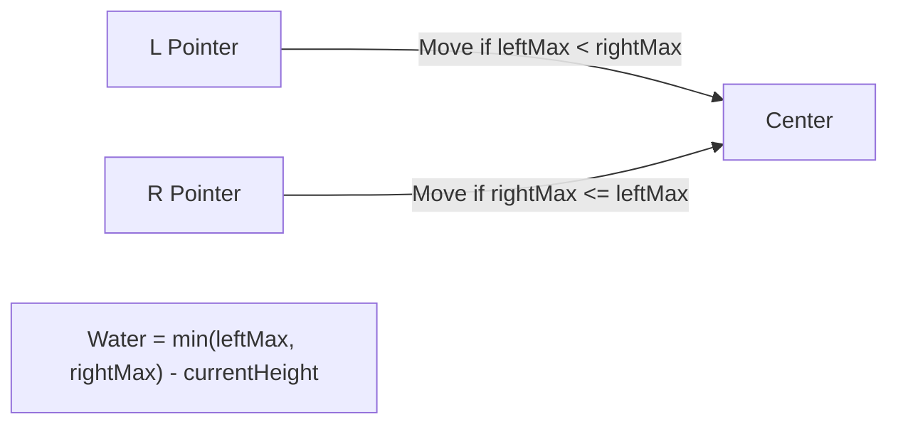

# 🌧️ Two Pointers: Trapping Rain Water

## 📝 Problem Description
Given `n` non-negative integers representing an elevation map where the width of each bar is 1, compute how much water it can trap after raining.

!!! info "Real-World Application"
    Used in geographical information systems (GIS) to model water runoff and flooding, or in industrial design to calculate the volume of irregular containers.

## 🛠️ Constraints & Edge Cases
- $n == height.length$
- $1 \le n \le 2 \cdot 10^4$
- $0 \le height[i] \le 10^5$
- **Edge Cases to Watch:**
    - Array with fewer than 3 bars (cannot trap water).
    - Elevation map with only increasing or decreasing heights.
    - Map with a large "valley" or multiple "peaks".

---

## 🧠 Approach & Intuition

!!! success "The Aha! Moment"
    The water trapped above any bar is limited by the **shorter** of the tallest bars to its left and right. Instead of pre-calculating these for every bar, we use two pointers to converge from the ends. We always move the pointer with the smaller "max height" seen so far, because that side is the bottleneck.

### 🐢 Brute Force (Naive)
For each bar, scan the entire left and right sides to find the maximum height. The water trapped is `min(max_left, max_right) - height[i]`. This takes $O(N^2)$.

### 🐇 Optimal Approach
1. Initialize `l = 0`, `r = n - 1`.
2. Keep track of `leftMax` and `rightMax`.
3. While `l < r`:
    - If `leftMax < rightMax`:
        - Increment `l`.
        - Update `leftMax = max(leftMax, height[l])`.
        - Add `leftMax - height[l]` to the total.
    - Else:
        - Decrement `r`.
        - Update `rightMax = max(rightMax, height[r])`.
        - Add `rightMax - height[r]` to the total.

### 🧩 Visual Tracing


---

## 💻 Solution Implementation

```python
(Implementation details need to be added...)
```

### ⏱️ Complexity Analysis
- **Time Complexity:** $\mathcal{O}(N)$ — We traverse the array exactly once with two pointers.
- **Space Complexity:** $\mathcal{O}(1)$ — We only use a few variables for pointers and max values.

---

## 🎤 Interview Toolkit

- **Alternative Approach:** You can also use a monotonic stack or pre-compute prefix/suffix max arrays ($O(N)$ space).
- **Follow-up:** How would you solve this if the input was a 2D grid of elevations? (Hint: Use a Min-Heap).

## 🔗 Related Problems
- [Container With Most Water](../container_with_most_water/PROBLEM.md)
- [Product of Array Except Self](../../01_arrays_hashing/product_of_array_except_self/PROBLEM.md)
