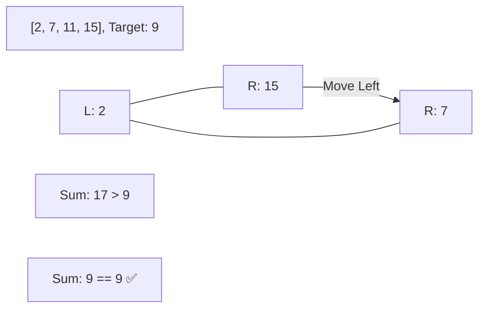

# 🎯 Two Pointers: Two Sum II - Input Array Is Sorted

## 📝 Problem Description
Given a 1-indexed array of integers `numbers` that is already sorted in non-decreasing order, find two numbers such that they add up to a specific `target` number. Return the indices of the two numbers, added by one, as an integer array `[index1, index2]` of length 2.

!!! info "Real-World Application"
    Finding pairs in sorted logs or sorted database indexes, where $O(1)$ space is preferred over the $O(N)$ space of a hash map.

## 🛠️ Constraints & Edge Cases
- $2 \le numbers.length \le 3 \cdot 10^4$
- $-1000 \le numbers[i] \le 1000$
- The tests are generated such that there is exactly one solution.
- **Edge Cases to Watch:**
    - Negative numbers in the array.
    - The two numbers are the same (e.g., target 6, array `[3, 3]`).
    - Indices must be 1-based.

---

## 🧠 Approach & Intuition

!!! success "The Aha! Moment"
    Since the array is **sorted**, we can use two pointers at opposite ends. If the current sum is too large, we move the right pointer left to decrease it. If the sum is too small, we move the left pointer right to increase it.

### 🐢 Brute Force (Naive)
Use nested loops to check every pair. This takes $O(N^2)$ and doesn't leverage the fact that the array is sorted.

### 🐇 Optimal Approach
1. Initialize `l = 0` and `r = len(numbers) - 1`.
2. While `l < r`:
    - Calculate `curSum = numbers[l] + numbers[r]`.
    - If `curSum > target`, decrement `r`.
    - If `curSum < target`, increment `l`.
    - If `curSum == target`, return `[l + 1, r + 1]`.

### 🧩 Visual Tracing


---

## 💻 Solution Implementation

```python
(Implementation details need to be added...)
```

### ⏱️ Complexity Analysis
- **Time Complexity:** $\mathcal{O}(N)$ — Each element is visited at most once.
- **Space Complexity:** $\mathcal{O}(1)$ — No extra data structures are used.

---

## 🎤 Interview Toolkit

- **Why not Binary Search?** You could use Binary Search for each element ($O(N \log N)$), but Two Pointers is faster ($O(N)$).
- **Follow-up:** What if the array is not sorted? (Use a hash map or sort it first).

## 🔗 Related Problems
- [Two Sum](../../01_arrays_hashing/two_sum/PROBLEM.md)
- [3Sum](../3sum/PROBLEM.md)
