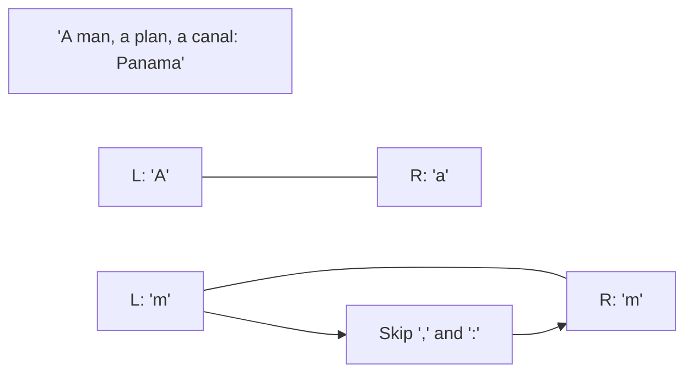

# ↔️ Two Pointers: Valid Palindrome

## 📝 Problem Description
A phrase is a palindrome if, after converting all uppercase letters into lowercase letters and removing all non-alphanumeric characters, it reads the same forward and backward. Alphanumeric characters include letters and numbers. Given a string `s`, return `true` if it is a palindrome, or `false` otherwise.

!!! info "Real-World Application"
    Data validation, string processing in compilers, or DNA sequence analysis where palindromic sequences often have biological significance.

## 🛠️ Constraints & Edge Cases
- $1 \le s.length \le 2 \cdot 10^5$
- `s` consists only of printable ASCII characters.
- **Edge Cases to Watch:**
    - Empty string or string with only non-alphanumeric characters (should be true).
    - String with mixed case.
    - String with numbers and special characters.

---

## 🧠 Approach & Intuition

!!! success "The Aha! Moment"
    Skip non-alphanumeric characters **on the fly** using two pointers. This allows you to check for a palindrome in $O(1)$ extra space, avoiding the need to create a new filtered string.

### 🐢 Brute Force (Naive)
Create a new string by filtering out non-alphanumeric characters and converting to lowercase. Then, compare this string with its reverse. This takes $O(N)$ space.

### 🐇 Optimal Approach
1. Initialize `l = 0` and `r = len(s) - 1`.
2. While `l < r`:
    - If `s[l]` is not alphanumeric, increment `l` and continue.
    - If `s[r]` is not alphanumeric, decrement `r` and continue.
    - Compare `s[l].lower()` and `s[r].lower()`.
    - If they don't match, return `false`.
    - Increment `l` and decrement `r`.
3. If the pointers meet, return `true`.

### 🧩 Visual Tracing


---

## 💻 Solution Implementation

```python
(Implementation details need to be added...)
```

### ⏱️ Complexity Analysis
- **Time Complexity:** $\mathcal{O}(N)$ — Each character is visited at most once.
- **Space Complexity:** $\mathcal{O}(1)$ — No extra string is created.

---

## 🎤 Interview Toolkit

- **Built-in methods:** Mention `isalnum()` and `lower()` in Python.
- **Follow-up:** What if you could delete at most one character to make it a palindrome? (See Valid Palindrome II).

## 🔗 Related Problems
- [Two Sum II](../two_sum_ii/PROBLEM.md)
