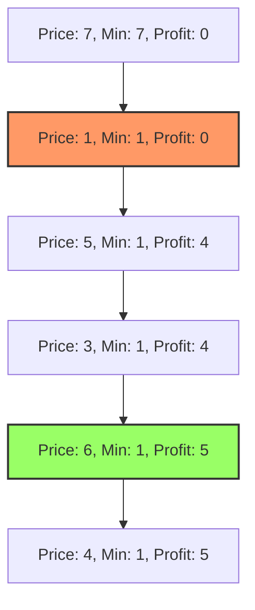

# 🪟 Sliding Window: Best Time to Buy and Sell Stock

## 📝 Problem Description
[LeetCode 121](https://leetcode.com/problems/best-time-to-buy-and-sell-stock/)

You are given an array `prices` where `prices[i]` is the price of a given stock on the $i^{th}$ day. You want to maximize your profit by choosing a single day to buy one stock and choosing a different day in the future to sell that stock. Return the maximum profit you can achieve from this transaction. If you cannot achieve any profit, return 0.

!!! info "Real-World Application"
    Real-time stock trading systems use similar algorithms to identify historical price trends and calculate potential returns on investment. It's also applicable in analyzing sensor data to find maximum increases over a time period.

## 🛠️ Constraints & Edge Cases
- $1 \le prices.length \le 10^5$
- $0 \le prices[i] \le 10^4$
- **Edge Cases to Watch:**
    - Prices are in strictly decreasing order (maximum profit = 0).
    - Array length is 1 (cannot sell, maximum profit = 0).
    - All prices are the same.

---

## 🧠 Approach & Intuition

!!! success "The Aha! Moment"
    The core trick is the **One-Pass Min-Tracker**. You only need to track the lowest price seen so far as you iterate. Any potential profit must come from selling at the current price after buying at the previously seen minimum price.

### 🐢 Brute Force (Naive)
Checking every possible buy-sell pair $(i, j)$ where $j > i$ results in an $\mathcal{O}(N^2)$ time complexity. With $10^5$ elements, $10^{10}$ operations will exceed the time limit for most online judges.

### 🐇 Optimal Approach
Use a single pass to track the minimum price and the maximum profit.
1. Initialize `min_price` to infinity and `max_profit` to 0.
2. Iterate through each `price` in the array:
   - If the current `price` is less than `min_price`, update `min_price`.
   - Otherwise, calculate the potential `profit = price - min_price` and update `max_profit` if it's greater than the current `max_profit`.
3. Return `max_profit`.

### 🧩 Visual Tracing


---

## 💻 Solution Implementation

```python
(Implementation details need to be added...)
```

### ⏱️ Complexity Analysis
- **Time Complexity:** $\mathcal{O}(N)$ — We iterate through the prices array exactly once.
- **Space Complexity:** $\mathcal{O}(1)$ — We only use two variables (`min_price` and `max_profit`), regardless of the input size.

---

## 🎤 Interview Toolkit

- **Harder Variant:** What if you could complete multiple transactions? (This leads to Best Time to Buy and Sell Stock II).
- **Alternative Data Structures:** Could be solved using a monotonic stack for variations, but a simple pointer approach is optimal here.

## 🔗 Related Problems
- [Longest Substring Without Repeating Characters](../longest_substring_without_repeating_characters/PROBLEM.md) — Uses a similar sliding window mindset.
- [Valid Palindrome](../../02_two_pointers/valid_palindrome/PROBLEM.md) — Foundation for pointer-based algorithms.
