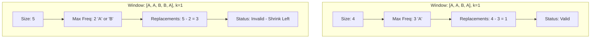

# 🪟 Sliding Window: Longest Repeating Character Replacement

## 📝 Problem Description
[LeetCode 424](https://leetcode.com/problems/longest-repeating-character-replacement/)

You are given a string `s` and an integer `k`. You can choose any character of the string and change it to any other uppercase English character. You can perform this operation at most `k` times. Return the length of the longest substring containing the same letter you can get after performing the above operations.

!!! info "Real-World Application"
    This algorithm is used in error correction for data transmission (finding the longest stable signal with some noise/flips allowed) and in bioinformatics for identifying approximate repeating patterns in DNA sequences.

## 🛠️ Constraints & Edge Cases
- $1 \le s.length \le 10^5$
- $0 \le k \le s.length$
- `s` consists of uppercase English letters.
- **Edge Cases to Watch:**
    - $k=0$ (must find longest existing sequence of identical characters).
    - $k \ge s.length$ (result is always $s.length$).
    - String with all unique characters.

---

## 🧠 Approach & Intuition

!!! success "The Aha! Moment"
    The "Aha!" moment is the **Max Frequency Anchor**. The number of replacements needed in any window is always `(Window Size) - (Count of the Most Frequent Character)`. If this value is $\le k$, the window is valid.

### 🐢 Brute Force (Naive)
Check all possible substrings $O(N^2)$ and for each, count character frequencies to see if replacements $\le k$ $O(N)$. Total complexity $\mathcal{O}(N^3)$, which is too slow for $N=10^5$.

### 🐇 Optimal Approach
Use a sliding window with a frequency map.
1. Maintain a `left` and `right` pointer for the window.
2. Track the frequency of each character in the current window and the `max_frequency` of any single character.
3. If `(right - left + 1) - max_frequency > k`, the window is invalid. Shrink it by moving `left` and updating the frequency map.
4. The key optimization: `max_frequency` doesn't strictly need to be decreased when shrinking the window, as we only care about windows that *exceed* our current best.

### 🧩 Visual Tracing


---

## 💻 Solution Implementation

```python
(Implementation details need to be added...)
```

### ⏱️ Complexity Analysis
- **Time Complexity:** $\mathcal{O}(N)$ — We iterate through the string once with the `right` pointer; the `left` pointer also only moves forward.
- **Space Complexity:** $\mathcal{O}(1)$ — The frequency map only stores up to 26 uppercase English letters.

---

## 🎤 Interview Toolkit

- **Harder Variant:** What if the character set is much larger (e.g., Unicode)? (Use a Hash Map instead of a fixed-size array).
- **Optimization:** Why don't we need to re-scan for the new `max_frequency` when shrinking the window? (Because a smaller `max_frequency` will never yield a longer valid window than what we've already found).

## 🔗 Related Problems
- [Longest Substring Without Repeating Characters](../longest_substring_without_repeating_characters/PROBLEM.md) — Fundamental sliding window.
- [Permutation in String](../permutation_in_string/PROBLEM.md) — Fixed-size sliding window.
