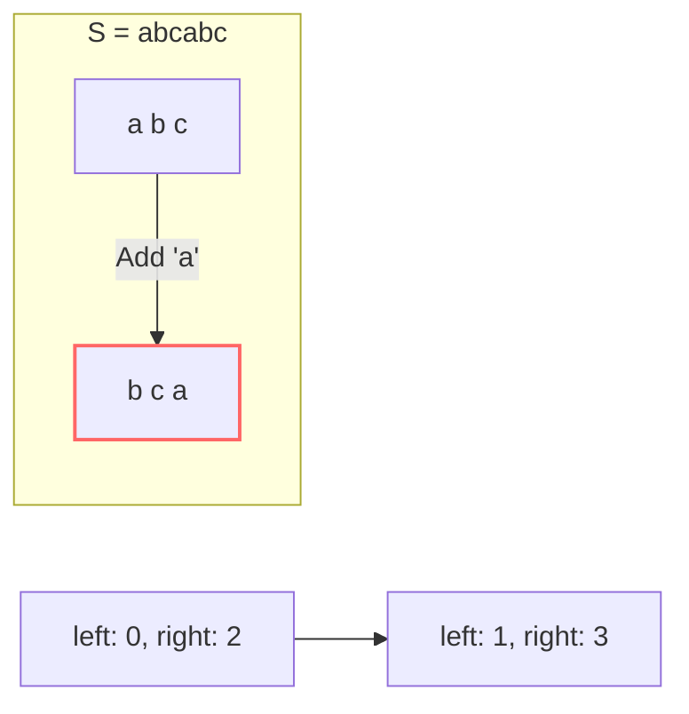

# 🪟 Sliding Window: Longest Substring Without Repeating Characters

## 📝 Problem Description
[LeetCode 3](https://leetcode.com/problems/longest-substring-without-repeating-characters/)

Given a string `s`, find the length of the longest substring without repeating characters.

!!! info "Real-World Application"
    This logic is used in network protocols to identify non-repeating signal sequences and in compression algorithms (like LZ77) where finding unique substrings is a foundational step.

## 🛠️ Constraints & Edge Cases
- $0 \le s.length \le 5 \cdot 10^4$
- `s` consists of English letters, digits, symbols, and spaces.
- **Edge Cases to Watch:**
    - Empty string (result = 0).
    - String with all same characters (result = 1).
    - String with no repeating characters (result = $s.length$).

---

## 🧠 Approach & Intuition

!!! success "The Aha! Moment"
    The "Aha!" moment is the **Window Invariant**. Instead of checking all possible substrings $\mathcal{O}(N^3)$, maintain a window of unique characters. When you encounter a duplicate at the `right` pointer, move the `left` pointer forward until the uniqueness invariant is restored.

### 🐢 Brute Force (Naive)
Checking every possible substring for unique characters takes $\mathcal{O}(N^3)$ (roughly $N^2$ substrings $\times$ $N$ to check uniqueness). For $N=5 \cdot 10^4$, this is approximately $10^{14}$ operations, which is way too slow.

### 🐇 Optimal Approach
Use a sliding window with a Hash Set or Hash Map.
1. Use two pointers, `left` and `right`, both starting at 0.
2. Expand the `right` pointer and add the character at `s[right]` to a set.
3. If `s[right]` is already in the set, a duplicate is found. Shrink the window by moving `left` forward and removing characters from the set until `s[right]` is unique again.
4. Update the maximum window size at each step: `max_len = max(max_len, right - left + 1)`.

### 🧩 Visual Tracing


---

## 💻 Solution Implementation

```python
(Implementation details need to be added...)
```

### ⏱️ Complexity Analysis
- **Time Complexity:** $\mathcal{O}(N)$ — Each character is visited at most twice (once by the `right` pointer and once by the `left` pointer).
- **Space Complexity:** $\mathcal{O}(\min(M, N))$ — $M$ is the size of the character set (e.g., 26 for English letters, 128 for ASCII).

---

## 🎤 Interview Toolkit

- **Optimization:** Use a Hash Map to store the *index* of each character. Instead of moving `left` one by one, you can "jump" `left` to `map[s[right]] + 1` directly.
- **Edge Case Probe:** How does your solution handle space characters? (They should be treated like any other character in the ASCII set).

## 🔗 Related Problems
- [Longest Repeating Replacement](../longest_repeating_character_replacement/PROBLEM.md) — Dynamic sliding window.
- [Permutation in String](../permutation_in_string/PROBLEM.md) — Fixed sliding window.
- [Valid Palindrome](../../02_two_pointers/valid_palindrome/PROBLEM.md) — Foundation for pointer manipulation.
