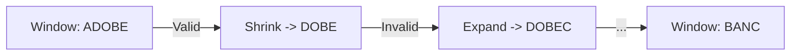

# 🤏 Sliding Window: Minimum Window Substring

## 📝 Description
[LeetCode 76](https://leetcode.com/problems/minimum-window-substring/)
Given two strings `s` and `t` of lengths `m` and `n` respectively, return the minimum window substring of `s` such that every character in `t` (including duplicates) is included in the window. If there is no such substring, return the empty string "".

!!! info "Real-World Application"
    Used in **Bioinformatics** (DNA sequencing to find a segment containing a set of markers) and **Text Search** (finding the smallest snippet in a document containing all query keywords).

## 🛠️ Constraints & Edge Cases
- $1 \le m, n \le 10^5$
- **Edge Cases to Watch:**
    - `s` is shorter than `t`.
    - `t` has duplicates (e.g., "AA").
    - No solution exists.

---

## 🧠 Approach & Intuition

!!! success "The Aha! Moment"
    We need a dynamic window that expands to find a valid solution and shrinks to optimize it. We can track the validity using a hash map of counts. Instead of checking the full map every time ($O(26)$ or $O(k)$), we can track a `have` vs `need` counter.

### 🐢 Brute Force (Naive)
Check every substring of `s`. For each, check if it contains all chars of `t`.
- **Time Complexity:** $O(N^3)$ or $O(N^2)$ depending on implementation.

### 🐇 Optimal Approach
1.  **Count:** Create a frequency map for `t`.
2.  **Expand (Right):** Move `r` pointer. Add `s[r]` to current window counts.
    - If `window[s[r]] == countT[s[r]]`, we satisfied one unique character requirement. Increment `have`.
3.  **Shrink (Left):** While `have == need` (window is valid):
    - Update result if current window is smaller than min.
    - Remove `s[l]` from window.
    - If `window[s[l]] < countT[s[l]]`, we are no longer valid. Decrement `have`.
    - Increment `l`.

### 🧩 Visual Tracing


---

## 💻 Solution Implementation

```python
(Implementation details need to be added...)
```

### ⏱️ Complexity Analysis
- **Time Complexity:** $\mathcal{O}(N)$ — `l` and `r` scan the string at most once.
- **Space Complexity:** $\mathcal{O}(1)$ — Map size is limited to character set (e.g., 52 letters).

---

## 🎤 Interview Toolkit

- **Harder Variant:** Find the minimum window subsequence (non-contiguous).
- **Edge Case:** What if `t` is empty? What if `s` doesn't contain `t`?

## 🔗 Related Problems
- [Sliding Window Maximum](../sliding_window_maximum/PROBLEM.md) — Next in category
- [Permutation in String](../permutation_in_string/PROBLEM.md) — Previous in category
