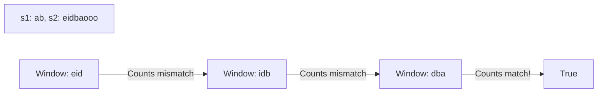

# 🔀 Sliding Window: Permutation in String

## 📝 Description
[LeetCode 567](https://leetcode.com/problems/permutation-in-string/)
Given two strings `s1` and `s2`, return `true` if `s2` contains a permutation of `s1`, or `false` otherwise.

!!! info "Real-World Application"
    This is effectively finding an **Anagram** as a substring. It's used in **Cryptography** (breaking ciphers via frequency analysis) and **Intrusion Detection Systems** (detecting signatures even if packet content is reordered).

## 🛠️ Constraints & Edge Cases
- $1 \le s1.length, s2.length \le 10^4$
- **Edge Cases to Watch:**
    - `s1` longer than `s2` (impossible).
    - Exact match.
    - No match.

---

## 🧠 Approach & Intuition

!!! success "The Aha! Moment"
    A permutation has the **exact same character counts**. We just need to find a substring in `s2` of length `len(s1)` that has the same frequency map. This is a **Fixed Size Sliding Window**.

### 🐢 Brute Force (Naive)
Generate all permutations of `s1` and search for them in `s2`.
- **Time Complexity:** $O(N! \cdot M)$ — Impossible for $N > 10$.

### 🐇 Optimal Approach
1.  Use two frequency arrays of size 26 (for 'a'-'z').
2.  Populate counts for `s1` and the first `len(s1)` chars of `s2`.
3.  Compare matches.
4.  **Slide:**
    - Move right: Increment count for new char.
    - Move left: Decrement count for old char.
    - Check for match at each step.
    - Optimization: Keep a variable `matches` (0 to 26). Update it only when counts change.

### 🧩 Visual Tracing


---

## 💻 Solution Implementation

```python
(Implementation details need to be added...)
```

### ⏱️ Complexity Analysis
- **Time Complexity:** $\mathcal{O}(N)$ — Sliding window scan.
- **Space Complexity:** $\mathcal{O}(1)$ — Array of size 26.

---

## 🎤 Interview Toolkit

- **Harder Variant:** Find *all* start indices of such permutations (Find All Anagrams in a String).

## 🔗 Related Problems
- [Minimum Window Substring](../minimum_window_substring/PROBLEM.md) — Next in category
