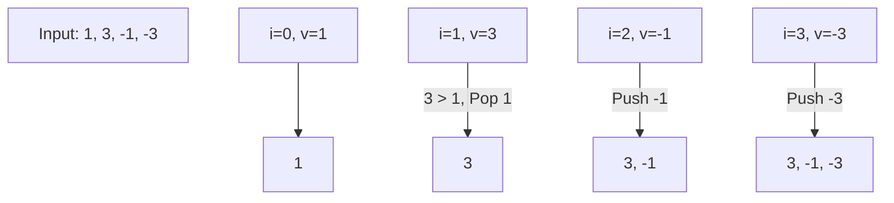

# 🪟 Sliding Window: Sliding Window Maximum

## 📝 Description
[LeetCode 239](https://leetcode.com/problems/sliding-window-maximum/)
You are given an array of integers `nums`, there is a sliding window of size `k` which is moving from the very left of the array to the very right. You can only see the `k` numbers in the window. Each time the sliding window moves right by one position. Return the max sliding window.

!!! info "Real-World Application"
    Critical in **Stock Trading** (finding max price in last K minutes for Bollinger Bands), **Network Traffic** (peak bandwidth usage in rolling windows), and **Stream Processing**.

## 🛠️ Constraints & Edge Cases
- $1 \le k \le nums.length \le 10^5$
- **Edge Cases to Watch:**
    - `k = 1` (Output is input).
    - `k = N` (Output is max of array).
    - Decreasing array.

---

## 🧠 Approach & Intuition

!!! success "The Aha! Moment"
    We need the max, but computing it is $O(k)$. We need something faster. A Max-Heap is $O(\log k)$. A **Monotonic Queue (Deque)** is $O(1)$. Why? If `nums[i] > nums[j]` and `i > j`, then `nums[j]` can **never** be the maximum again because `nums[i]` is larger and stays in the window longer. We can discard `nums[j]`.

### 🐢 Brute Force (Naive)
Iterate through all windows, find max.
- **Time Complexity:** $O(N \cdot K)$.

### 🐇 Optimal Approach
1.  Use a Deque to store **indices**.
2.  **Pop Smaller:** Before adding `nums[i]`, pop back of deque if `nums[back] < nums[i]`. This maintains decreasing order.
3.  **Pop Outdated:** If `deque.front()` is out of the window (`i - k`), pop front.
4.  **Result:** The front of the deque is the max for the current window. Add to results if `i >= k - 1`.

### 🧩 Visual Tracing


---

## 💻 Solution Implementation

```python
(Implementation details need to be added...)
```

### ⏱️ Complexity Analysis
- **Time Complexity:** $\mathcal{O}(N)$ — Each element is added and removed from deque at most once.
- **Space Complexity:** $\mathcal{O}(K)$ — Deque stores at most K elements.

---

## 🎤 Interview Toolkit

- **Alternative:** Could use a Segment Tree ($O(N \log N)$) or Heaps ($O(N \log K)$).

## 🔗 Related Problems
- [Minimum Window Substring](../minimum_window_substring/PROBLEM.md) — Previous in category
- [Daily Temperatures](../../04_stack/daily_temperatures/PROBLEM.md) — Monotonic Queue/Stack Logic
