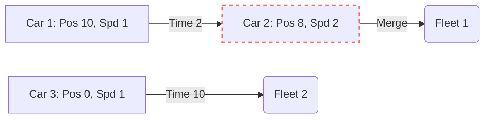

# 🚗 Stack: Car Fleet

## 📝 Problem Description
There are `n` cars going to the same destination along a one-lane road. The destination is at position `target`. You are given two arrays `position` and `speed`. A car can never pass another car ahead of it, but it can catch up to it and drive bumper to bumper at the same speed. The distance between these two cars is ignored - they are assumed to have the same position. A car fleet is some non-empty set of cars driving at the same position and same speed. Return the number of car fleets that will arrive at the destination.

!!! info "Real-World Application"
    This problem models traffic flow and collision detection in simulations, or task scheduling where dependent jobs are grouped into sequential batches based on completion time constraints.

## 🛠️ Constraints & Edge Cases
- $1 \le n \le 10^5$
- $0 < \text{target} \le 10^6$
- $0 < \text{speed}[i] \le 10^6$
- $0 \le \text{position}[i] < \text{target}$
- **Edge Cases to Watch:** 
    - Only one car exists.
    - All cars start at the same position (not possible per constraints, but good to consider).
    - Cars start in reverse order of their target reach time.

---

## 🧠 Approach & Intuition

!!! success "The Aha! Moment"
    Instead of simulating movement, focus on the time each car reaches the target: $T = (\text{target} - \text{position}) / \text{speed}$. If a car behind takes less time to reach the target than the car in front, it will collide with the car in front and become part of that fleet.

### 🐢 Brute Force (Naive)
The naive approach would be to simulate the car positions at every time step $t$. This is computationally expensive, especially when the target distance is large, leading to $O(T \times N)$ complexity, which fails for $N=10^5$.

### 🐇 Optimal Approach
1.  **Pairing:** Combine each car's position and speed into a list of tuples.
2.  **Sorting:** Sort these pairs by position in descending order (from closest to the target to farthest).
3.  **Iteration:** Iterate through the sorted list, keeping track of the time the current fleet takes to reach the target (`maxTime`).
4.  **Collision Check:** For each car, calculate its time to target. If its time is greater than `maxTime`, it forms a new fleet and updates `maxTime`. Otherwise, it catches up and merges into the existing fleet.

### 🧩 Visual Tracing


---

## 💻 Solution Implementation

```python
(Implementation details need to be added...)
```

### ⏱️ Complexity Analysis
- **Time Complexity:** $\mathcal{O}(N \log N)$ — Sorting the cars takes the most time, while the single pass iteration is $\mathcal{O}(N)$.
- **Space Complexity:** $\mathcal{O}(N)$ — Storing the pairs of positions and speeds.

---

## 🎤 Interview Toolkit

- **Harder Variant:** What if the road had multiple lanes?
- **Alternative Data Structures:** Could this be solved using a Monotonic Stack directly? (Yes, the stack can store the arrival times of fleets).

## 🔗 Related Problems
- [Daily Temperatures](../daily_temperatures/PROBLEM.md) — Uses similar Monotonic stack/array iteration logic.
- [Largest Rectangle in Histogram](../largest_rectangle_in_histogram/PROBLEM.md) — Advanced stack usage.
