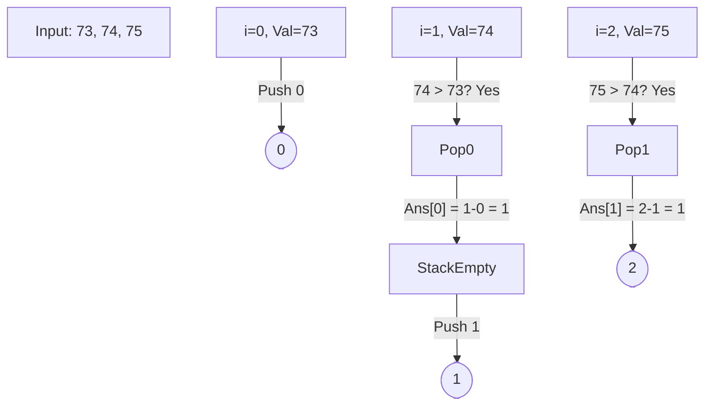

# 🌡️ Stack: Daily Temperatures

## 📝 Description
[LeetCode 739](https://leetcode.com/problems/daily-temperatures/)
Given an array of integers `temperatures` represents the daily temperatures, return an array `answer` such that `answer[i]` is the number of days you have to wait after the `i`th day to get a warmer temperature. If there is no future day for which this is possible, keep `answer[i] == 0`.

!!! info "Real-World Application"
    This pattern is used in **Stock Market Analysis** (finding the next day with higher profit), **Weather Forecasting** (trends analysis), and generally finding the "Next Greater Element" in a stream of data.

## 🛠️ Constraints & Edge Cases
- $1 \le \text{temperatures.length} \le 10^5$
- $30 \le \text{temperatures}[i] \le 100$
- **Edge Cases to Watch:**
    - Decreasing sequence (result is all 0s).
    - Strictly increasing sequence (result is all 1s except last).
    - Array with single element.

---

## 🧠 Approach & Intuition

!!! success "The Aha! Moment"
    Instead of scanning forward for every day, we can maintain a **Monotonic Decreasing Stack**. If the current day is warmer than the day at the top of the stack, it means we found the "warmer future" for that previous day.

### 🐢 Brute Force (Naive)
For each day `i`, iterate through `j = i+1` to `N` to find the first `temperatures[j] > temperatures[i]`.
- **Time Complexity:** $O(N^2)$ — In the worst case (decreasing array), we scan the rest of the array for every element.

### 🐇 Optimal Approach
1.  Initialize a stack to store **indices** of days.
2.  Iterate through the `temperatures` array with index `i`.
3.  While the stack is not empty AND `temperatures[i]` is greater than the temperature at the index on the top of the stack:
    - Pop the index `prev_index` from the stack.
    - We found a warmer day for `prev_index`! The wait is `i - prev_index`.
    - Update `answer[prev_index]`.
4.  Push the current index `i` onto the stack.

### 🧩 Visual Tracing


---

## 💻 Solution Implementation

```python
(Implementation details need to be added...)
```

### ⏱️ Complexity Analysis
- **Time Complexity:** $\mathcal{O}(N)$ — Each element is pushed and popped at most once.
- **Space Complexity:** $\mathcal{O}(N)$ — In the worst case (decreasing order), the stack holds all elements.

---

## 🎤 Interview Toolkit

- **Harder Variant:** Can you solve this with $O(1)$ extra space (excluding the output array)? (Hint: Iterate backwards).
- **Alternative Data Structures:** Could you use a Segment Tree? (Yes, but overkill $O(N \log N)$).

## 🔗 Related Problems
- [Car Fleet](../car_fleet/PROBLEM.md) — Next in category
- [Generate Parentheses](../generate_parentheses/PROBLEM.md) — Previous in category
- [Contains Duplicate](../../01_arrays_hashing/contains_duplicate/PROBLEM.md) — Prerequisite: Arrays & Hashing
