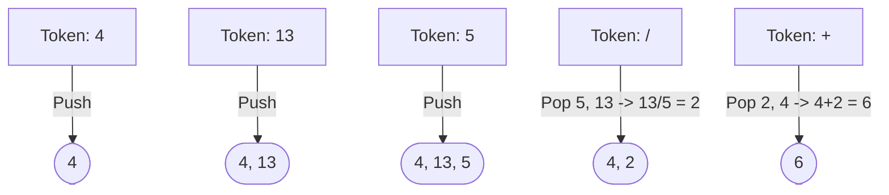

# 🧮 Stack: Evaluate Reverse Polish Notation

## 📝 Description
[LeetCode 150](https://leetcode.com/problems/evaluate-reverse-polish-notation/)
Evaluate the value of an arithmetic expression in Reverse Polish Notation (RPN). Valid operators are `+`, `-`, `*`, and `/`. Each operand may be an integer or another expression. Note that division between two integers should truncate toward zero.

!!! info "Real-World Application"
    RPN is used in **PostScript** (printing language), **HP Calculators**, and **Stack-based Virtual Machines** (like the JVM or Python's bytecode interpreter) because it eliminates the need for parentheses and complex precedence rules.

## 🛠️ Constraints & Edge Cases
- $1 \le \text{tokens.length} \le 10^4$
- `tokens[i]` is either an operator or an integer.
- **Edge Cases to Watch:**
    - Division by zero (though problem constraints usually ensure validity).
    - Negative result from division (should truncate towards zero, e.g., `-3 / 2 = -1`).
    - Single number input (no operators).

---

## 🧠 Approach & Intuition

!!! success "The Aha! Moment"
    In RPN, the operator always follows its operands. This is perfect for a **Stack**: when you see a number, remember it (push). When you see an operator, use the last two numbers you remembered (pop), calculate, and remember the result (push).

### 🐢 Brute Force (Naive)
Scanning the string repeatedly to find the first operator, evaluating it, and reconstructing the string. This is $O(N^2)$ due to string manipulation and repeated scanning.

### 🐇 Optimal Approach
1.  Initialize an empty stack.
2.  Iterate through each token in the input.
3.  If the token is a number, push it onto the stack.
4.  If the token is an operator (`+`, `-`, `*`, `/`):
    - Pop the top two elements: `b` (first pop) and `a` (second pop).
    - **Note:** Order matters for `-` and `/`. It is `a - b` or `a / b`.
    - Perform the operation.
    - Push the result back onto the stack.
5.  The final result is the only element remaining in the stack.

### 🧩 Visual Tracing


---

## 💻 Solution Implementation

```python
(Implementation details need to be added...)
```

### ⏱️ Complexity Analysis
- **Time Complexity:** $\mathcal{O}(N)$ — We traverse the tokens once.
- **Space Complexity:** $\mathcal{O}(N)$ — The stack can store up to N/2 operands.

---

## 🎤 Interview Toolkit

- **Harder Variant:** Support more complex operators like `^` (power) or `sqrt`.
- **Alternative Data Structures:** Could you use a recursive approach? (Yes, traversing from the end, but it's trickier).
- **Edge Case:** How does your language handle integer division for negative numbers? (Python `//` floors `-3 // 2 = -2`, but C++ `/` truncates `-3 / 2 = -1`. The problem asks for truncation).

## 🔗 Related Problems
- [Generate Parentheses](../generate_parentheses/PROBLEM.md) — Next in category
- [Min Stack](../min_stack/PROBLEM.md) — Previous in category
- [Basic Calculator](https://leetcode.com/problems/basic-calculator/) — Related stack problem
