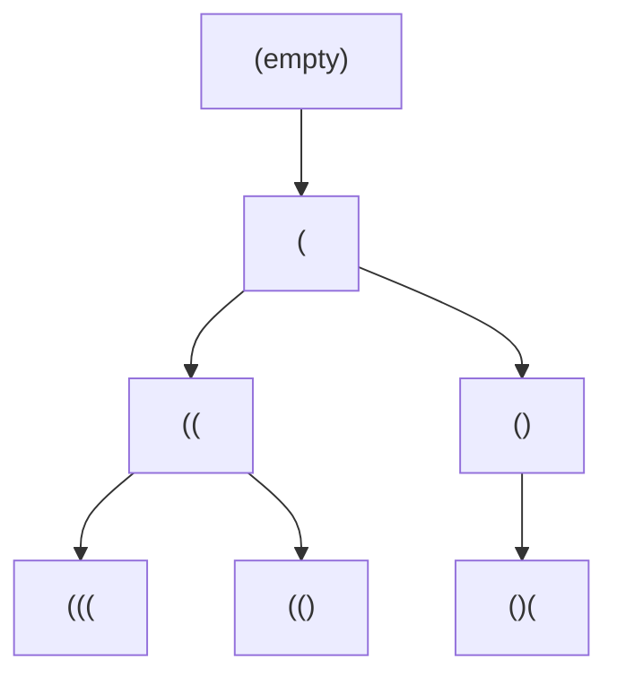

# 🎭 Stack: Generate Parentheses

## 📝 Description
[LeetCode 22](https://leetcode.com/problems/generate-parentheses/)
Given `n` pairs of parentheses, write a function to generate all combinations of well-formed parentheses.

!!! info "Real-World Application"
    This problem relates to **Compiler Design** (syntax analysis), **XML/HTML Parsing**, and generating valid test cases for parsers. It helps in understanding Context-Free Grammars.

## 🛠️ Constraints & Edge Cases
- $1 \le n \le 8$
- **Edge Cases to Watch:**
    - `n=1`: Output `["()"]`.
    - `n=0`: Output `[""]` (though constraint says 1, usually good to know).

---

## 🧠 Approach & Intuition

!!! success "The Aha! Moment"
    We don't need to generate *all* permutations and check them. We can build valid strings incrementally. We can add a `(` if we haven't used all `n` opening brackets. We can add a `)` only if we have more open brackets than closed ones used so far.

### 🐢 Brute Force (Naive)
Generate all $2^{2n}$ sequences of `(` and `)`. Then check each one for validity using a counter or stack.
- **Time Complexity:** $O(2^{2n} \cdot n)$ — Extremely slow.

### 🐇 Optimal Approach (Backtracking)
1.  Start an empty string.
2.  Maintain counts of `open` and `closed` parentheses added.
3.  **Recursive Step:**
    - If `open < n`: Add `(` and recurse.
    - If `closed < open`: Add `)` and recurse.
4.  **Base Case:** If string length is `2 * n`, add to results.

### 🧩 Visual Tracing


---

## 💻 Solution Implementation

```python
(Implementation details need to be added...)
```

### ⏱️ Complexity Analysis
- **Time Complexity:** $\mathcal{O}(4^n / \sqrt{n})$ — This is the **nth Catalan number**, which describes the number of valid parenthesis sequences.
- **Space Complexity:** $\mathcal{O}(n)$ — The max depth of the recursion stack.

---

## 🎤 Interview Toolkit

- **Harder Variant:** Generate parentheses with multiple types `()`, `[]`, `{}`.
- **Alternative Data Structures:** Can this be done iteratively? (Yes, using a queue or explicit stack).

## 🔗 Related Problems
- [Daily Temperatures](../daily_temperatures/PROBLEM.md) — Next in category
- [Evaluate RPN](../evaluate_reverse_polish_notation/PROBLEM.md) — Previous in category
- [Valid Parentheses](../valid_parentheses/PROBLEM.md) — Prerequisite
