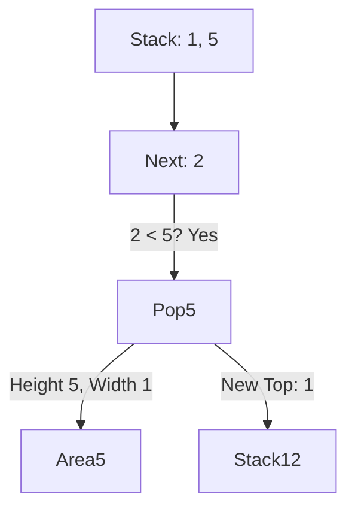

# 📊 Stack: Largest Rectangle in Histogram

## 📝 Description
[LeetCode 84](https://leetcode.com/problems/largest-rectangle-in-histogram/)
Given an array of integers `heights` representing the histogram's bar height where the width of each bar is 1, return the area of the largest rectangle in the histogram.

!!! info "Real-World Application"
    This algorithm is a key component in **Image Processing** (finding the largest clear area in a binary image) and **maximal rectangle** problems in matrices (e.g., finding the largest specific crop area).

## 🛠️ Constraints & Edge Cases
- $1 \le \text{heights.length} \le 10^5$
- $0 \le \text{heights}[i] \le 10^4$
- **Edge Cases to Watch:**
    - Sorted arrays (ascending/descending).
    - All bars same height.
    - Heights include 0.

---

## 🧠 Approach & Intuition

!!! success "The Aha! Moment"
    A rectangle's height is limited by the shortest bar within it. For any specific bar `h`, if we assume `h` is the height of the rectangle, how wide can we extend? To the left until we hit a smaller bar, and to the right until we hit a smaller bar. We can find these boundaries efficiently using a **Monotonic Increasing Stack**.

### 🐢 Brute Force (Naive)
For every pair of indices `i` and `j`, find the minimum height between them and calculate area.
- **Time Complexity:** $O(N^2)$ — Too slow for $10^5$.

### 🐇 Optimal Approach
1.  Maintain a stack of indices with increasing heights.
2.  Iterate `i` from `0` to `N`.
3.  If `heights[i]` is smaller than the bar at `stack.top()`, it means the bar at `stack.top()` cannot extend further right. We calculate its max area now.
    - Pop the top index: `h = heights[pop()]`.
    - Width `w = i - stack.top() - 1` (distance between current index and the new top).
    - MaxArea = `max(MaxArea, h * w)`.
4.  **Twist:** What about bars left in the stack? Push a `0` height at the end of the array to force-pop everything remaining.

### 🧩 Visual Tracing


---

## 💻 Solution Implementation

```python
(Implementation details need to be added...)
```
*(Note: This implementation pushes `start` index back, which is a clever variation of the standard index stack approach).*

### ⏱️ Complexity Analysis
- **Time Complexity:** $\mathcal{O}(N)$ — Each element is pushed and popped exactly once.
- **Space Complexity:** $\mathcal{O}(N)$ — For the stack.

---

## 🎤 Interview Toolkit

- **Harder Variant:** Maximal Rectangle in a 2D Binary Matrix (LeetCode 85).
- **Alternative:** Divide and Conquer (Segment Tree) is $O(N \log N)$.

## 🔗 Related Problems
- [Car Fleet](../car_fleet/PROBLEM.md) — Previous in category
- [Maximal Rectangle](https://leetcode.com/problems/maximal-rectangle/) — Extension
