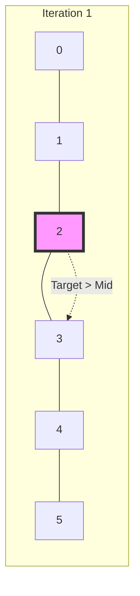

# 🔍 Binary Search: Binary Search

## 📝 Problem Description
Given an array of integers `nums` which is sorted in ascending order, and an integer `target`, write a function to search `target` in `nums`. If `target` exists, then return its index. Otherwise, return `-1`.

!!! info "Real-World Application"
    Binary search is the backbone of database indexing (B-Trees) and version control systems (e.g., `git bisect` to find the commit that introduced a bug).

## 🛠️ Constraints & Edge Cases
- $1 \le nums.length \le 10^4$
- $-10^4 < nums[i], target < 10^4$
- All integers in `nums` are unique.
- `nums` is sorted in ascending order.
- **Edge Cases to Watch:**
    - Array with a single element (match/no-match).
    - Target is the first or last element.
    - Target is smaller than the first or larger than the last element.

---

## 🧠 Approach & Intuition

!!! success "The Aha! Moment"
    The array is **sorted**. This allows us to eliminate half of the search space in each step by comparing the target with the middle element.

### 🐢 Brute Force (Naive)
A simple linear scan through the array would take $\mathcal{O}(N)$ time. For an array of 1 million elements, this could take up to 1 million comparisons.

### 🐇 Optimal Approach (Binary Search)
1. Initialize two pointers: `low = 0` and `high = len(nums) - 1`.
2. While `low <= high`:
    - Calculate the middle index: `mid = low + (high - low) // 2`.
    - If `nums[mid] == target`, return `mid`.
    - If `nums[mid] < target`, the target must be in the right half: `low = mid + 1`.
    - Else, the target must be in the left half: `high = mid - 1`.
3. If the loop ends, the target is not present: return `-1`.

### 🧩 Visual Tracing


---

## 💻 Solution Implementation

```python
(Implementation details need to be added...)
```

### ⏱️ Complexity Analysis
- **Time Complexity:** $\mathcal{O}(\log N)$ — The search space is halved in each iteration.
- **Space Complexity:** $\mathcal{O}(1)$ — We only use a constant amount of extra space for pointers.

---

## 🎤 Interview Toolkit

- **Harder Variant:** How would you find the first or last occurrence of a target in an array with duplicates?
- **Integer Overflow:** Why use `low + (high - low) // 2` instead of `(low + high) // 2`? (To prevent overflow in languages with fixed-size integers like C++/Java).

## 🔗 Related Problems
- `[Search a 2D Matrix](../search_2d_matrix/PROBLEM.md)` — Binary search on a flattened matrix.
- `[Find Minimum in Rotated Sorted Array](../find_minimum_in_rotated_sorted_array/PROBLEM.md)` — Binary search with a twist.
