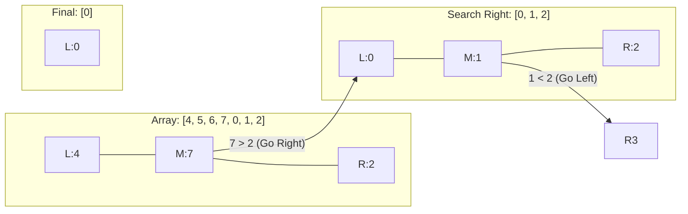

# 📉 Binary Search: Find Minimum in Rotated Sorted Array

## 📝 Problem Description
Suppose an array of length `n` sorted in ascending order is rotated between `1` and `n` times. Given the sorted rotated array `nums` of unique elements, return the minimum element of this array.

[LeetCode 153](https://leetcode.com/problems/find-minimum-in-rotated-sorted-array/)

!!! info "Real-World Application"
    Used in **Version Control Systems** (like `git bisect`) to find the first broken commit in a range that has been "rotated" or partitioned by a bug. It's also useful for finding the start of a cyclic log file or a load-balanced set of rotated records.

## 🛠️ Constraints & Edge Cases
- $1 \le nums.length \le 10^5$
- $-5000 \le nums[i] \le 5000$
- All integers in `nums` are **unique**.
- **Edge Cases to Watch:**
    - Array is not rotated (already sorted).
    - Array has only one element.
    - Array has two elements.

---

## 🧠 Approach & Intuition

!!! success "The Aha! Moment"
    The core trick is comparing `nums[mid]` with the **rightmost element** `nums[right]`. If `nums[mid] > nums[right]`, the "cliff" (minimum) must be to the right of `mid`. Otherwise, the minimum is at `mid` or to its left.

### 🐢 Brute Force (Naive)
A simple linear scan through the array to find the smallest element.
- **Time Complexity:** $\mathcal{O}(N)$
- **Why it fails:** We aren't utilizing the "sorted" nature of the rotated array. The problem explicitly asks for an $\mathcal{O}(\log N)$ solution.

### 🐇 Optimal Approach
Use **Binary Search** to find the pivot point (the "cliff").
1. Initialize `left = 0`, `right = n - 1`.
2. While `left < right`:
    - Calculate `mid = (left + right) // 2`.
    - Compare `nums[mid]` with `nums[right]`.
    - If `nums[mid] > nums[right]`: The minimum must be in the right half. Set `left = mid + 1`.
    - Else: The minimum is in the left half (including `mid`). Set `right = mid`.
3. Return `nums[left]`.

### 🧩 Visual Tracing


---

## 💻 Solution Implementation

```python
(Implementation details need to be added...)
```

### ⏱️ Complexity Analysis
- **Time Complexity:** $\mathcal{O}(\log N)$ — We divide the search space in half at each step using binary search.
- **Space Complexity:** $\mathcal{O}(1)$ — We only use a few variables for pointers (`left`, `right`, `mid`).

---

## 🎤 Interview Toolkit

- **Harder Variant:** What if the array contains duplicates? (LeetCode 154 - the worst case becomes $O(N)$ when `nums[mid] == nums[right]`).
- **Pivot Point:** This same logic can be used to find how many times the array was rotated.

## 🔗 Related Problems
- [Search in Rotated Sorted Array](../search_in_rotated_sorted_array/PROBLEM.md) — Uses similar pivot logic to find a target.
- [Koko Eating Bananas](../koko_eating_bananas/PROBLEM.md) — Binary search on answer.
