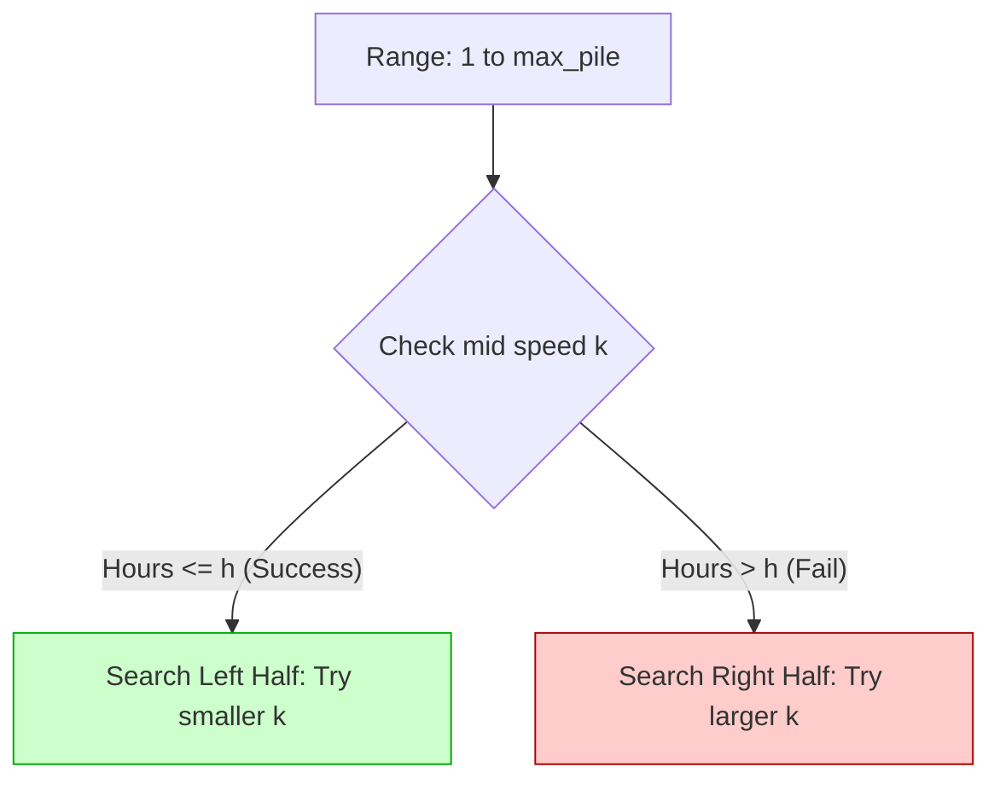

# 🍌 Binary Search: Koko Eating Bananas

## 📝 Problem Description
Koko loves to eat bananas. There are `n` piles of bananas, the `i`th pile has `piles[i]` bananas. The guards have gone and will come back in `h` hours. Koko can decide her bananas-per-hour eating speed of `k`. Each hour, she chooses some pile of bananas and eats `k` bananas from that pile. If the pile has less than `k` bananas, she eats all of them instead. Return the minimum integer `k` such that she can eat all the bananas within `h` hours.

[LeetCode 875](https://leetcode.com/problems/koko-eating-bananas/)

!!! info "Real-World Application"
    Used in **Load Balancing** and **Rate Limiting**. For example, finding the minimum throughput (requests per second) required to process a queue of tasks before a fixed deadline, or determining the optimal number of servers needed to handle a burst of traffic.

## 🛠️ Constraints & Edge Cases
- $1 \le piles.length \le 10^4$
- $piles.length \le h \le 10^9$
- $1 \le piles[i] \le 10^9$
- **Edge Cases to Watch:**
    - $h = piles.length$ (Koko must eat at a speed of $\max(piles)$).
    - $h$ is extremely large (Speed could be 1).
    - Very large values of `piles[i]` (requires efficient sum/ceil calculation).

---

## 🧠 Approach & Intuition

!!! success "The Aha! Moment"
    This is a **Binary Search on the Answer** problem. The speed `k` is monotonic: if she can finish at speed $k$, she can also finish at any speed $k' > k$. This property allows us to binary search the possible *range* of speeds $[1, \max(piles)]$.

### 🐢 Brute Force (Naive)
Try every speed $k$ starting from 1 up to $\max(piles)$. For each $k$, calculate the total hours required.
- **Time Complexity:** $\mathcal{O}(N \cdot \max(P))$
- **Why it fails:** Given that $\max(P) = 10^9$ and $N = 10^4$, the worst case could be $10^{13}$ operations, which will result in a Time Limit Exceeded error.

### 🐇 Optimal Approach
Use **Binary Search** to find the minimum $k$.
1. Set the search space: `low = 1`, `high = max(piles)`.
2. While `low <= high`:
    - Calculate `mid = (low + high) // 2`.
    - Simulate eating at speed `mid`. Total hours = $\sum \lceil pile / mid \rceil$.
    - If `total_hours <= h`:
        - This speed works! Try a slower speed: `res = mid`, `high = mid - 1`.
    - Else:
        - Too slow! Increase speed: `low = mid + 1`.
3. Return `res`.

### 🧩 Visual Tracing


---

## 💻 Solution Implementation

```python
(Implementation details need to be added...)
```

### ⏱️ Complexity Analysis
- **Time Complexity:** $\mathcal{O}(N \log(\max(P)))$ — We perform binary search over the range of possible speeds (1 to $\max(P)$). For each step, we iterate through all $N$ piles.
- **Space Complexity:** $\mathcal{O}(1)$ — No extra memory besides a few pointers and variables.

---

## 🎤 Interview Toolkit

- **Ceiling Division Trick:** Use `(pile + k - 1) // k` to calculate `ceil(pile / k)` without floating-point math.
- **Why max(piles)?** Why is the upper bound $\max(piles)$? Because eating faster than the largest pile doesn't save any more time (one hour per pile is the absolute minimum).

## 🔗 Related Problems
- [Find Minimum in Rotated Sorted Array](../find_minimum_in_rotated_sorted_array/PROBLEM.md) — Standard binary search on array.
- [Split Array Largest Sum](../../13_1d_dynamic_programming/split_array_largest_sum/PROBLEM.md) — Another "Binary Search on Answer" problem.
