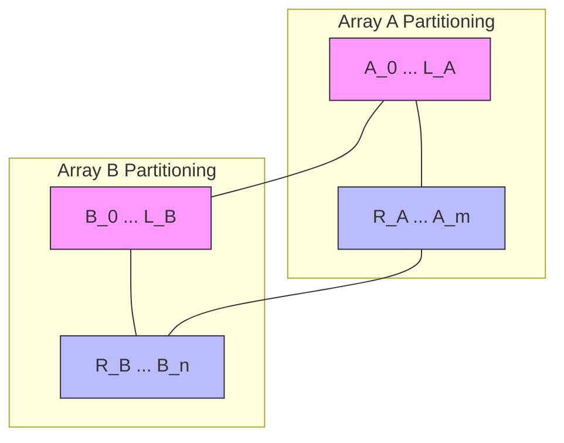

# 📊 Binary Search: Median of Two Sorted Arrays

## 📝 Problem Description
Given two sorted arrays `nums1` and `nums2` of size `m` and `n` respectively, return the median of the two sorted arrays. The overall run time complexity should be $\mathcal{O}(\log (m+n))$.

[LeetCode 4](https://leetcode.com/problems/median-of-two-sorted-arrays/)

!!! info "Real-World Application"
    Critical for **distributed data processing** where datasets are split across multiple servers. Instead of merging massive sorted logs to find the median, you can apply binary search to find the partition point across machines, saving massive amounts of network and memory bandwidth.

## 🛠️ Constraints & Edge Cases
- $0 \le m \le 1000$
- $0 \le n \le 1000$
- $1 \le m + n \le 2000$
- **Edge Cases to Watch:**
    - One array is completely empty.
    - Arrays are of the same size.
    - Median is a single middle element (odd total length).
    - Median is the average of two middle elements (even total length).

---

## 🧠 Approach & Intuition

!!! success "The Aha! Moment"
    Instead of merging, we use **Binary Search on the partition points**. We need to find a way to cut both arrays such that the total number of elements in the left parts equals the total in the right parts, and all elements on the left are smaller than those on the right.

### 🐢 Brute Force (Naive)
Merge the two arrays into a single sorted array of size $(m+n)$ and return the middle element.
- **Time Complexity:** $\mathcal{O}(M+N)$
- **Space Complexity:** $\mathcal{O}(M+N)$
- **Why it fails:** The problem specifically requires $\mathcal{O}(\log(M+N))$ time complexity.

### 🐇 Optimal Approach
Use **Binary Search** to partition the *smaller* array (let's call it `A`).
1. Ensure `A` is the smaller array to minimize the binary search range.
2. Initialize `low = 0`, `high = len(A)`.
3. While `low <= high`:
    - `partA = (low + high) // 2`
    - `partB = (total_elements + 1) // 2 - partA`
    - Determine boundary values: `L_A, R_A, L_B, R_B`. (Use $-\infty$ or $+\infty$ if partitions are empty).
    - If `L_A <= R_B` and `L_B <= R_A`:
        - Partition is correct.
        - If odd total: `return max(L_A, L_B)`
        - If even total: `return (max(L_A, L_B) + min(R_A, R_B)) / 2.0`
    - Else if `L_A > R_B`: Partition `A` too far right; move `high = partA - 1`.
    - Else: Partition `A` too far left; move `low = partA + 1`.

### 🧩 Visual Tracing


---

## 💻 Solution Implementation

```python
(Implementation details need to be added...)
```

### ⏱️ Complexity Analysis
- **Time Complexity:** $\mathcal{O}(\log(\min(M, N)))$ — We binary search over the shorter array's partition points.
- **Space Complexity:** $\mathcal{O}(1)$ — No extra memory besides a few pointers.

---

## 🎤 Interview Toolkit

- **Why the smaller array?** Searching the smaller array ensures the corresponding partition point in the larger array is always within valid bounds.
- **Median calculation:** Be careful with the `(x + y + 1) // 2` formula for odd/even cases.

## 🔗 Related Problems
- [Koko Eating Bananas](../koko_eating_bananas/PROBLEM.md) — Search on Answer.
- [Find Minimum in Rotated Sorted Array](../find_minimum_in_rotated_sorted_array/PROBLEM.md) — Pivot search.
