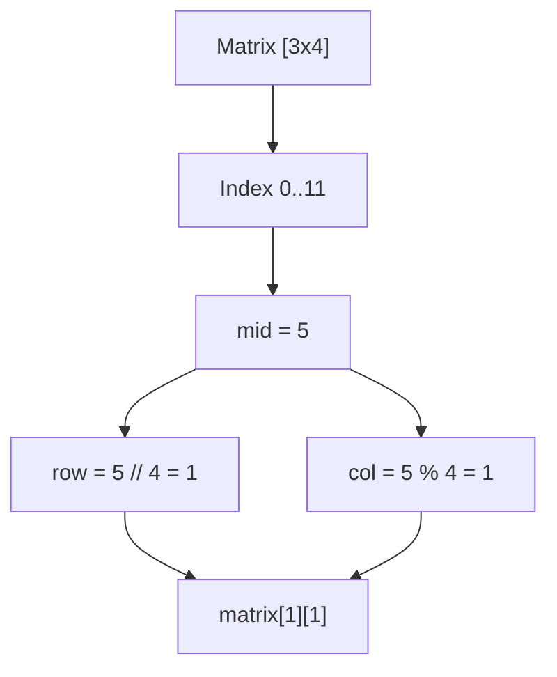

# 📉 Binary Search: Search a 2D Matrix

## 📝 Problem Description
Write an efficient algorithm that searches for a value `target` in an `m x n` integer matrix `matrix`. This matrix has the following properties:
1. Integers in each row are sorted from left to right.
2. The first integer of each row is greater than the last integer of the previous row.

[LeetCode 74](https://leetcode.com/problems/search-a-2d-matrix/)

!!! info "Real-World Application"
    **Spreadsheet Search & Database Indexing:** When searching for a specific record in a sorted database file or a large Excel sheet where rows are naturally ordered, "virtually flattening" the structure allows for logarithmic search instead of scanning millions of cells.

## 🛠️ Constraints & Edge Cases
- $m == matrix.length$
- $n == matrix[i].length$
- $1 \le m, n \le 100$
- $-10^4 \le matrix[i][j], target \le 10^4$
- **Edge Cases to Watch:**
    - Single element matrix `[[1]]`
    - Target smaller than first element or larger than last element
    - Empty matrix (though constraints say $m, n \ge 1$ here)

---

## 🧠 Approach & Intuition

!!! success "The Aha! Moment"
    **The Virtual Flattener:** Because the matrix is sorted in a "Z-pattern" (row-by-row), it is effectively a single sorted array of size $M \times N$. We can map any 1D index `i` to 2D coordinates using:
    - `row = i // n`
    - `col = i % n`

### 🐢 Brute Force (Naive)
Scanning every element in the matrix one by one. This would take $O(M \times N)$ time. While simple, it fails to utilize the sorted property of the grid.

### 🐇 Optimal Approach
Use Binary Search on the virtual range $[0, M \times N - 1]$.
1. Initialize `low = 0` and `high = (m * n) - 1`.
2. Calculate `mid = (low + high) // 2`.
3. Map `mid` to its 2D position: `val = matrix[mid // n][mid % n]`.
4. If `val == target`, return `true`.
5. If `val < target`, move `low = mid + 1`.
6. Else, move `high = mid - 1`.

### 🧩 Visual Tracing


---

## 💻 Solution Implementation

```python
(Implementation details need to be added...)
```

### ⏱️ Complexity Analysis
- **Time Complexity:** $\mathcal{O}(\log(M \times N))$ — Standard binary search over the total number of elements.
- **Space Complexity:** $\mathcal{O}(1)$ — No extra data structures used, only a few pointers.

---

## 🎤 Interview Toolkit

- **Harder Variant:** [Search a 2D Matrix II](https://leetcode.com/problems/search-a-2d-matrix-ii/) where only rows and columns are sorted independently.
- **Alternative Approach:** Step-wise search starting from top-right corner ($O(M+N)$), though Binary Search is more efficient here.

## 🔗 Related Problems
- [Koko Eating Bananas](../koko_eating_bananas/PROBLEM.md)
- [Search in Rotated Sorted Array](../search_in_rotated_sorted_array/PROBLEM.md)
- [Binary Search](../binary_search/PROBLEM.md)
