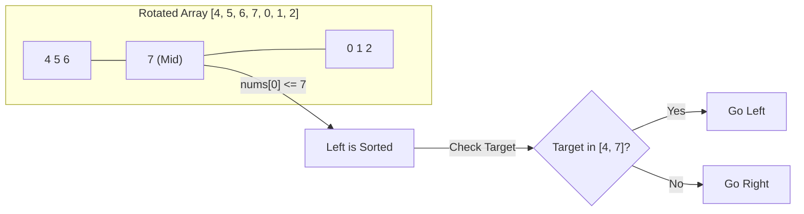

# 🔍 Searching: Search in Rotated Sorted Array

## 📝 Problem Description
There is an integer array `nums` sorted in ascending order (with distinct values). Prior to being passed to your function, `nums` is possibly rotated at an unknown pivot index `k` ($1 \le k < nums.length$).
Given the array `nums` **after** the rotation and an integer `target`, return the index of `target` if it is in `nums`, or `-1` if it is not in `nums`.

[LeetCode 33](https://leetcode.com/problems/search-in-rotated-sorted-array/)

!!! info "Real-World Application"
    **Log File Handling:** In systems with circular logging or ring buffers, data is written sequentially until it wraps around. Searching for a specific timestamp in these structures requires handling the "pivot" point where the newest data meets the oldest.

## 🛠️ Constraints & Edge Cases
- $1 \le nums.length \le 5000$
- $-10^4 \le nums[i], target \le 10^4$
- All values of `nums` are unique.
- **Edge Cases to Watch:**
    - Array not rotated (standard binary search)
    - Pivot at first or last index
    - Single element array `[1]`

---

## 🧠 Approach & Intuition

!!! success "The Aha! Moment"
    **The Half-Sorted Split:** In any rotated sorted array, when we pick a middle element `mid`, **at least one of the two halves (left or right) MUST be normally sorted.** We can check which half is sorted and whether the `target` lies within its boundaries to decide our next step.

### 🐢 Brute Force (Naive)
A simple linear search through the array takes $\mathcal{O}(N)$ time. This works but ignores the sorted property completely and fails for large datasets.

### 🐇 Optimal Approach
Modified Binary Search:
1. Initialize `low = 0` and `high = n - 1`.
2. Find `mid`. If `nums[mid] == target`, return `mid`.
3. Check which half is sorted:
   - If `nums[low] <= nums[mid]`: **Left half is sorted.**
     - If `target` is between `nums[low]` and `nums[mid]`, go left: `high = mid - 1`.
     - Otherwise, the target must be in the right half: `low = mid + 1`.
   - Else: **Right half is sorted.**
     - If `target` is between `nums[mid]` and `nums[high]`, go right: `low = mid + 1`.
     - Otherwise, go left: `high = mid - 1`.

### 🧩 Visual Tracing


---

## 💻 Solution Implementation

```python
(Implementation details need to be added...)
```

### ⏱️ Complexity Analysis
- **Time Complexity:** $\mathcal{O}(\log N)$ — We still halve the search space at each step.
- **Space Complexity:** $\mathcal{O}(1)$ — Only constant pointers used.

---

## 🎤 Interview Toolkit

- **Harder Variant:** [Search in Rotated Sorted Array II](https://leetcode.com/problems/search-in-rotated-sorted-array-ii/) where elements are NOT unique. (Aha! The duplicate case breaks the $O(\log N)$ guarantee because we can't tell which half is sorted if `nums[low] == nums[mid]`).
- **Pivot Search:** Another way to solve this is to find the pivot first ($O(\log N)$) and then do binary search on the correct half.

## 🔗 Related Problems
- [Find Minimum in Rotated Sorted Array](../find_minimum_in_rotated_sorted_array/PROBLEM.md)
- [Time Based KV Store](../time_based_key_value_store/PROBLEM.md)
- [Binary Search](../binary_search/PROBLEM.md)
