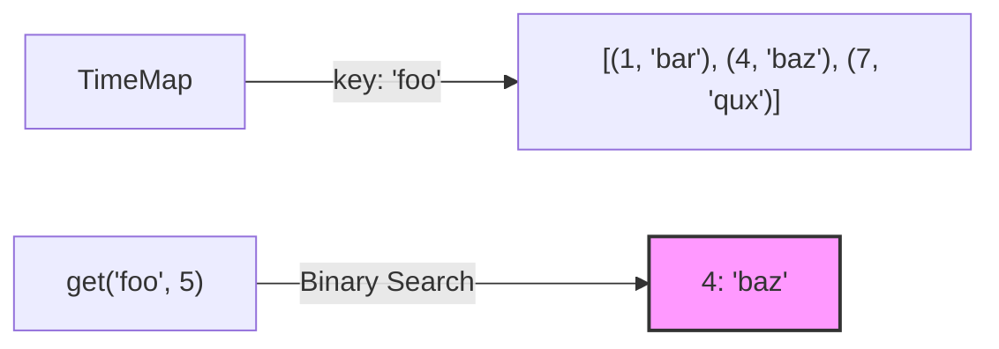

# ⏱️ Binary Search: Time Based Key-Value Store

## 📝 Problem Description
Design a time-based key-value data structure that can store multiple values for the same key at different time stamps and retrieve the key's value at a certain timestamp.

Implement the `TimeMap` class:
- `TimeMap()` Initializes the object of the data structure.
- `void set(String key, String value, int timestamp)` Stores the key `key` with the value `value` at the given time `timestamp`.
- `String get(String key, int timestamp)` Returns a value such that `set` was called previously, with `timestamp_prev <= timestamp`. If there are multiple such values, it returns the value associated with the largest `timestamp_prev`. If there are no values, it returns `""`.

[LeetCode 981](https://leetcode.com/problems/time-based-key-value-store/)

!!! info "Real-World Application"
    **Version Control & Multi-Version Concurrency Control (MVCC):** Databases (like PostgreSQL or DynamoDB) and version control systems (like Git) often need to retrieve the state of a record at a specific point in time. Searching through history for the "latest available version before time X" is a core operation in these systems.

## 🛠️ Constraints & Edge Cases
- $1 \le key.length, value.length \le 100$
- $key$ and $value$ consist of lowercase English letters and digits.
- $1 \le timestamp \le 10^7$
- All the timestamps $timestamp$ of `set` are strictly increasing.
- **Edge Cases to Watch:**
    - Query timestamp is earlier than the first stored timestamp.
    - Multiple values for the same key (need the largest timestamp $\le$ target).
    - Requesting a key that doesn't exist.

---

## 🧠 Approach & Intuition

!!! success "The Aha! Moment"
    **Implicit Sorting:** Since `set` calls are made with strictly increasing timestamps, each key's history list is naturally sorted. This means we can avoid manual sorting and immediately apply **Binary Search** to find the "floor" of the requested timestamp.

### 🐢 Brute Force (Naive)
Storing a list of all versions for a key and scanning backward from the requested timestamp until a match is found. In the worst case, this takes $\mathcal{O}(N)$ per `get` operation, where $N$ is the number of versions for that key.

### 🐇 Optimal Approach
1. **Data Structure:** Use a Hash Map where keys map to a list of pairs `[(timestamp, value), ...]`.
2. **`set`:** Append the new pair to the list. Since timestamps are increasing, the list remains sorted. $\mathcal{O}(1)$.
3. **`get`:** 
   - Perform Binary Search on the list associated with the key.
   - We need the largest timestamp $\le$ query_time.
   - Use `bisect_right` on timestamps and return the element at `index - 1`. $\mathcal{O}(\log N)$.

### 🧩 Visual Tracing


---

## 💻 Solution Implementation

```python
(Implementation details need to be added...)
```

### ⏱️ Complexity Analysis
- **Time Complexity:** 
    - `set`: $\mathcal{O}(1)$ — Appending to a list.
    - `get`: $\mathcal{O}(\log N)$ — Binary search over the history of a key.
- **Space Complexity:** $\mathcal{O}(N)$ — Storing all key-value-timestamp triplets.

---

## 🎤 Interview Toolkit

- **Harder Variant:** What if timestamps are NOT strictly increasing for `set`? (Aha! Then we must sort the list or use a TreeMap/SortedList which would make `set` $\mathcal{O}(\log N)$).
- **Memory Optimization:** If many keys have the same values at different times, can we use string interning or pointers to save space?

## 🔗 Related Problems
- [Search in Rotated Sorted Array](../search_in_rotated_sorted_array/PROBLEM.md)
- [Binary Search](../binary_search/PROBLEM.md)
- [Koko Eating Bananas](../koko_eating_bananas/PROBLEM.md)
