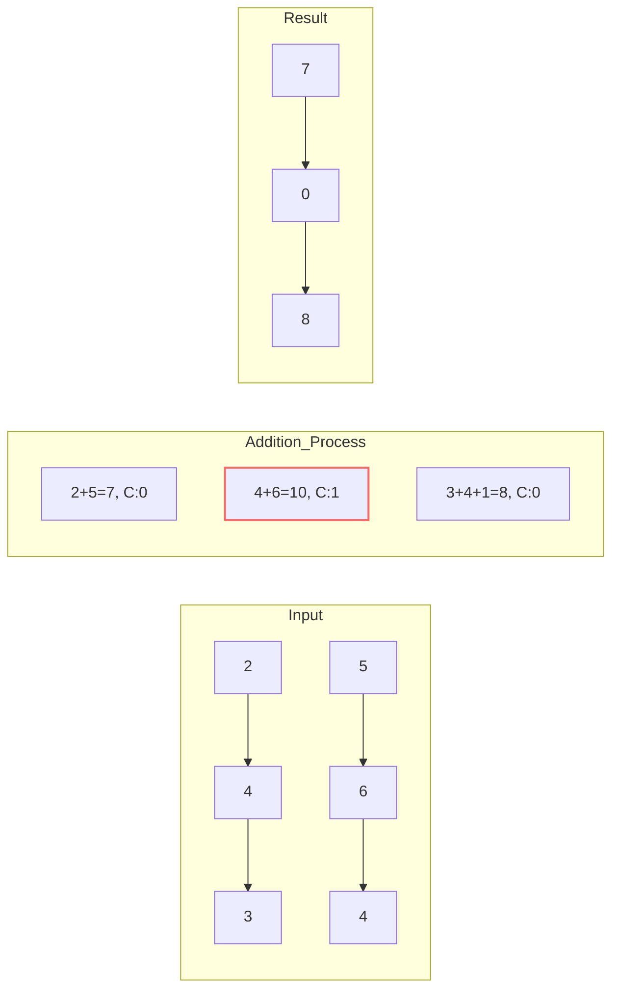

# ➕ Linked List: Add Two Numbers

## 📝 Problem Description
[LeetCode 2](https://leetcode.com/problems/add-two-numbers/)

You are given two non-empty linked lists representing two non-negative integers. The digits are stored in reverse order, and each of their nodes contains a single digit. Add the two numbers and return the sum as a linked list.

You may assume the two numbers do not contain any leading zero, except the number 0 itself.

!!! info "Real-World Application"
    **Infinite Precision Arithmetic:** Standard 64-bit integers overflow at $\approx 1.8 \times 10^{19}$. Linked lists are used in `BigInt` libraries (like in Python or Java's `BigInteger`) to represent numbers with thousands of digits, allowing for calculations in cryptography and scientific computing without overflow.

## 🛠️ Constraints & Edge Cases
- The number of nodes in each linked list is in the range $[1, 100]$.
- $0 \le Node.val \le 9$
- It is guaranteed that the list represents a number that does not have leading zeros.
- **Edge Cases to Watch:**
    - Lists of different lengths (e.g., $99 + 1$).
    - Sum results in a new most-significant digit (e.g., $5 + 5 = 10$, requires a new node).
    - One or both lists representing the number 0.

---

## 🧠 Approach & Intuition

!!! success "The Aha! Moment"
    Think like grade-school addition! Since the digits are already in **reverse order**, the head of the list is the **least significant digit** (the ones place). We can iterate through both lists simultaneously, adding corresponding digits and maintaining a `carry` variable for the next position.

### 🐢 Brute Force (Naive)
Convert both linked lists into actual integers (e.g., `[2,4,3]` becomes `342`), add the integers, and then convert the sum back into a linked list.
- **Why it fails:** This works for small numbers, but as soon as the linked list represents a number larger than $2^{64}-1$ (about 20 digits), the integer will **overflow**. The problem constraints allow up to 100 digits, far exceeding standard primitive types.

### 🐇 Optimal Approach
Use a **Dummy Head** to simplify the result list construction and a single `while` loop that continues as long as there are nodes to process or a carry remains.

1. Initialize a `dummy` node and a `curr` pointer to it.
2. Initialize `carry = 0`.
3. Loop while `l1` is not null, OR `l2` is not null, OR `carry > 0`:
    - Get values from `l1` and `l2` (default to 0 if null).
    - Calculate `column_sum = val1 + val2 + carry`.
    - Update `carry = column_sum // 10`.
    - Create a new node with `column_sum % 10` and attach to `curr.next`.
    - Advance `curr`, `l1`, and `l2`.
4. Return `dummy.next`.

### 🧩 Visual Tracing
Adding $342 + 465$ (represented as `2->4->3` + `5->6->4`):



---

## 💻 Solution Implementation

```python
(Implementation details need to be added...)
```

### ⏱️ Complexity Analysis
- **Time Complexity:** $\mathcal{O}(\max(N, M))$ — We iterate through the longer of the two lists exactly once.
- **Space Complexity:** $\mathcal{O}(\max(N, M))$ — The length of the new list is at most $\max(N, M) + 1$.

---

## 🎤 Interview Toolkit

- **Follow-up:** What if the digits are stored in **forward order**?
    - *Answer:* You would either need to reverse the lists first or use a stack to process them in LIFO order to handle the carry correctly.
- **Memory Optimization:** If we are allowed to modify the input lists, could we store the result in one of them to achieve $\mathcal{O}(1)$ extra space?
    - *Answer:* Yes, we can overwrite `l1` or `l2` nodes, but we'd still need to handle the case where the sum is longer than both.

## 🔗 Related Problems
- [Reverse Linked List](../reverse_list/PROBLEM.md) — Often a prerequisite if the input isn't reversed.
- [Multiply Strings](../../17_math_geometry/multiply_strings/PROBLEM.md) — Similar digit-by-digit logic for multiplication.
- [Sum of Two Integers](../../18_bit_manipulation/sum_of_two_integers/PROBLEM.md) — Addition using bitwise operators.
