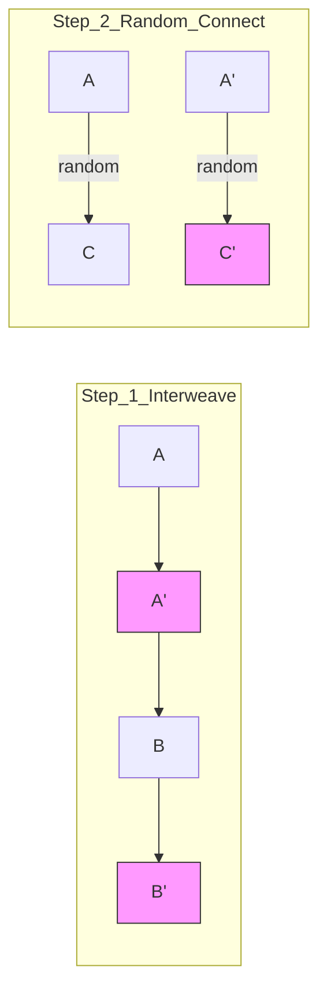

# 👯 Linked List: Copy List with Random Pointer

## 📝 Problem Description
[LeetCode 138](https://leetcode.com/problems/copy-list-with-random-pointer/)

A linked list of length `n` is given such that each node contains an additional random pointer, which could point to any node in the list, or `null`. 

Construct a **deep copy** of the list. The deep copy should consist of exactly `n` brand new nodes, where each new node has its value set to the value of its corresponding original node. Both the `next` and `random` pointer of the new nodes should point to new nodes in the copied list such that the pointers in the original list and copied list represent the same list state. **None of the pointers in the new list should point to nodes in the original list.**

!!! info "Real-World Application"
    **Deep Cloning Complex Objects:** This problem mirrors how libraries (like Java's `clone()` or Python's `copy.deepcopy()`) handle objects with complex circular references or pointers. It's essential when you need to duplicate a data structure (like a state in a game or a database graph) without affecting the original.

## 🛠️ Constraints & Edge Cases
- $0 \le n \le 1000$
- $-10^4 \le Node.val \le 10^4$
- `Node.random` is `null` or points to some node in the linked list.
- **Edge Cases to Watch:**
    - Empty list (`head is null`).
    - Random pointers pointing to themselves.
    - Random pointers pointing to the same node multiple times.
    - All random pointers being `null`.

---

## 🧠 Approach & Intuition

!!! success "The Aha! Moment"
    The challenge is that `random` pointers can point to nodes that **haven't been created yet** during a single-pass traversal. We have two main ways to solve this:
    1. **The Hash Map:** Use a dictionary to map `OriginalNode -> CopyNode`.
    2. **The Interweaving (Space Hero):** Temporarily interweave the copy nodes directly into the original list (`A -> A' -> B -> B'`). This allows us to find the copy of any original node `X` by just looking at `X.next`.

### 🐢 Brute Force (Hash Map)
1. **Pass 1:** Traverse the list and create a new node for each original node. Store the mapping in a hash map: `{OriginalNode: CopyNode}`.
2. **Pass 2:** Traverse the list again. For each node, set `CopyNode.next = Map[OriginalNode.next]` and `CopyNode.random = Map[OriginalNode.random]`.
- **Complexity:** $\mathcal{O}(N)$ Time, $\mathcal{O}(N)$ Space.

### 🐇 Optimal Approach (Interweaving)
This approach achieves $\mathcal{O}(1)$ extra space by using the original list's pointers to find the copies.

1. **Step 1 (Create Copies):** Create a copy of each node and insert it immediately after the original node: `Curr -> Copy -> Next`.
2. **Step 2 (Connect Randoms):** For each original node `curr`, its copy's random should be `curr.random.next` (if `curr.random` exists).
3. **Step 3 (Extract List):** Split the interweaved list into the original list and the copy list.

### 🧩 Visual Tracing
Interweaving $A \to B \to C$:



---

## 💻 Solution Implementation

```python
(Implementation details need to be added...)
```

### ⏱️ Complexity Analysis
- **Time Complexity:** $\mathcal{O}(N)$ — We make three passes through the list (creation, random-linking, and separation).
- **Space Complexity:** $\mathcal{O}(1)$ — No extra data structures are used (excluding the memory for the new nodes).

---

## 🎤 Interview Toolkit

- **Follow-up:** Can we solve this in one pass?
    - *Answer:* Yes, with a hash map. As you traverse, if you encounter a `next` or `random` node that hasn't been created, create it on the fly and store it in the map.
- **Comparison:** Why use interweaving over a hash map?
    - *Answer:* If memory is extremely tight (e.g., embedded systems) and the number of nodes is large, avoiding $\mathcal{O}(N)$ extra hash map memory is a significant win.

## 🔗 Related Problems
- [Clone Graph](../../11_graphs/clone_graph/PROBLEM.md) — The 2D version of this problem.
- [Linked List Cycle](../linked_list_cycle/PROBLEM.md) — Basic pointer manipulation.
- [LRU Cache](../lru_cache/PROBLEM.md) — Managing nodes in a hash map + linked list.
