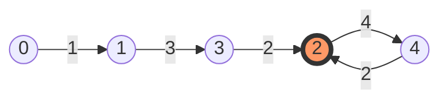

# 🕵️ Linked List: Find the Duplicate Number

## 📝 Problem Description
[LeetCode 287](https://leetcode.com/problems/find-the-duplicate-number/)

Given an array of integers `nums` containing `n + 1` integers where each integer is in the range `[1, n]` inclusive.

There is only one repeated number in `nums`, return this repeated number.

You must solve the problem **without** modifying the array `nums` and uses only **constant extra space**.

!!! info "Real-World Application"
    **Cycle Detection in Graphs:** This algorithm (Floyd's Cycle-Finding) is used to detect loops in network topologies, identify deadlocks in operating system resource allocation, and even in cryptography for Pollard's rho algorithm to find collisions in hash functions.

## 🛠️ Constraints & Edge Cases
- $1 \le n \le 10^5$
- `nums.length == n + 1`
- $1 \le nums[i] \le n$
- All the integers in `nums` appear only once except for precisely one integer which appears two or more times.
- **Edge Cases to Watch:**
    - Smallest possible $n=1$ (array `[1, 1]`).
    - The duplicate appears more than twice (e.g., `[2, 2, 2, 2]`).
    - The duplicate is at the beginning or end of the array.

---

## 🧠 Approach & Intuition

!!! success "The Aha! Moment"
    Treat the array values as **pointers**. Since each value is between 1 and $n$, and the array indices are 0 to $n$, every value "points" to a valid index. Because there is a duplicate, two different indices will point to the same value, creating a **cycle** in the traversal. Finding the duplicate is equivalent to finding the **entrance of the cycle**.

### 🐢 Brute Force (Naive)
1. **Sorting:** Sort the array and check for adjacent equal elements. ($O(N \log N)$ time, but modifies the array).
2. **Hash Set:** Store seen numbers in a set. ($O(N)$ time, but $O(N)$ space).
- **Why they fail:** The problem explicitly forbids modifying the array and requires $O(1)$ extra space.

### 🐇 Optimal Approach (Floyd's Cycle-Finding)
This is a two-phase algorithm often called the "Tortoise and the Hare."

1. **Phase 1 (Finding the Meeting Point):** Use two pointers, `slow` and `fast`. Move `slow` by one step (`nums[slow]`) and `fast` by two steps (`nums[nums[fast]]`). They will eventually meet inside the cycle.
2. **Phase 2 (Finding the Cycle Entrance):** Reset `slow` to the start of the array (index 0). Move both `slow` and `fast` by one step at a time. The point where they meet is the entrance to the cycle, which is the duplicate number.

### 🧩 Visual Tracing
Example: `nums = [1, 3, 4, 2, 2]`


*In this graph, index 2 is pointed to by both index 3 and index 4. The value 2 is the duplicate.*

---

## 💻 Solution Implementation

```python
(Implementation details need to be added...)
```

### ⏱️ Complexity Analysis
- **Time Complexity:** $\mathcal{O}(N)$ — Both phases take at most $N$ steps.
- **Space Complexity:** $\mathcal{O}(1)$ — We only use two integer pointers, regardless of the input size.

---

## 🎤 Interview Toolkit

- **Follow-up:** Can you solve this if we can modify the array?
    - *Answer:* Yes, using **Negative Marking**. Iterate through the array, and for each value `x`, negate the value at `nums[abs(x)]`. If you encounter a value that is already negative, you've found the duplicate.
- **Scale Question:** What if $n$ is too large to fit the whole array in memory?
    - *Answer:* We can use **Binary Search on the range [1, n]**. For a chosen middle value `mid`, count how many numbers in the array are $\le mid$. If the count $> mid$, the duplicate is in $[1, mid]$; otherwise, it's in $[mid+1, n]$. This takes $O(N \log N)$ time but only $O(1)$ space and can be done by streaming the data.

## 🔗 Related Problems
- [Linked List Cycle](../linked_list_cycle/PROBLEM.md) — The fundamental concept behind this solution.
