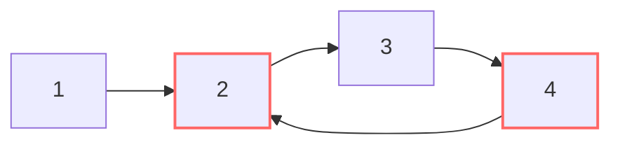

# 🏎️ Linked List: Linked List Cycle

## 📝 Problem Description
Given `head`, the head of a linked list, determine if the linked list has a cycle in it. A cycle exists if there is some node in the list that can be reached again by continuously following the `next` pointer.

!!! info "Real-World Application"
    Cycle detection is used in distributed systems to detect routing loops in networks and in garbage collection algorithms (to identify circular references).

## 🛠️ Constraints & Edge Cases
- The number of nodes in the list is in the range $[0, 10^4]$.
- $-10^5 \le Node.val \le 10^5$
- **Edge Cases to Watch:**
    - Empty list or single node (no cycle possible unless it points to itself).
    - Cycle at the very beginning (head points to itself).
    - Cycle at the very end (last node points to an earlier node).

---

## 🧠 Approach & Intuition

!!! success "The Aha! Moment"
    Think of two runners on a track. If the track is a loop (cycle), the faster runner will eventually "lap" the slower runner and meet them again.

### 🐢 Brute Force (Hash Set)
Iterate through the list and store each node's address/reference in a Hash Set. If we encounter a node already in the set, there's a cycle.
- **Time:** $\mathcal{O}(N)$
- **Space:** $\mathcal{O}(N)$

### 🐇 Optimal Approach (Floyd's Tortoise and Hare)
1. Initialize two pointers, `slow` and `fast`, at the head.
2. While `fast` and `fast.next` are not `None`:
    - Move `slow` forward by 1 step.
    - Move `fast` forward by 2 steps.
    - If `slow == fast`, return `True` (cycle detected).
3. If the loop finishes, return `False` (no cycle).

### 🧩 Visual Tracing


---

## 💻 Solution Implementation

```python
(Implementation details need to be added...)
```

### ⏱️ Complexity Analysis
- **Time Complexity:** $\mathcal{O}(N)$ — In the worst case, the fast pointer traverses the list twice.
- **Space Complexity:** $\mathcal{O}(1)$ — We only use two pointers.

---

## 🎤 Interview Toolkit

- **Cycle Start:** How do you find the *entry point* of the cycle? (Linked List Cycle II).
- **Length:** How do you find the length of the cycle?

## 🔗 Related Problems
- `[Linked List Cycle II](../linked_list_cycle_ii/PROBLEM.md)` — Finding the entry node.
- `[Find the Duplicate Number](../find_the_duplicate_number/PROBLEM.md)` — Solving a cycle problem in an array.
