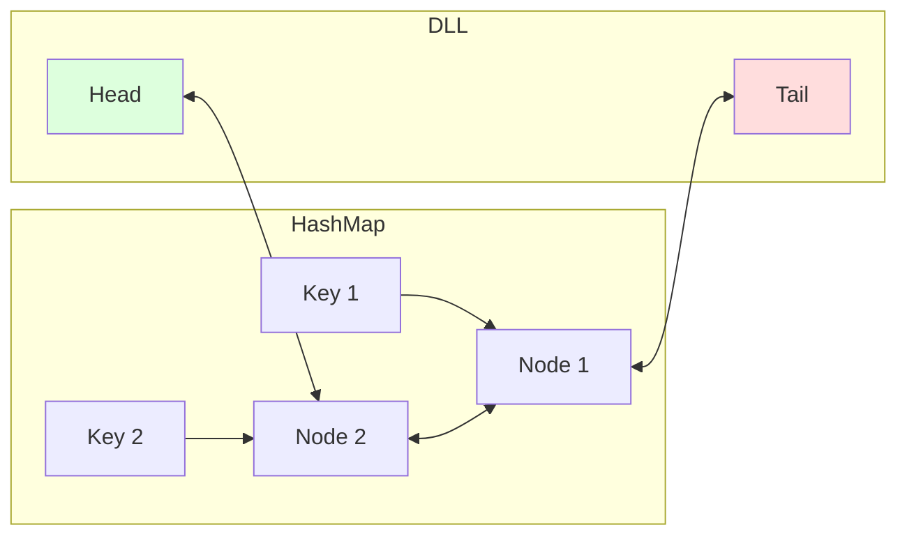

# 💾 Linked Lists: LRU Cache

## 📝 Problem Description
[LeetCode 146](https://leetcode.com/problems/lru-cache/)
Design a data structure that follows the constraints of a **Least Recently Used (LRU)** cache.

Implement the `LRUCache` class:
- `LRUCache(int capacity)` Initialize the cache with positive size capacity.
- `int get(int key)` Return the value of the key if it exists, otherwise return -1.
- `void put(int key, int value)` Update the value if the key exists. Otherwise, add the key-value pair. If the number of keys exceeds the capacity, **evict** the least recently used key.

!!! info "Real-World Application"
    LRU Caching is ubiquitous in system design:
    - **Redis:** Eviction policy for memory management.
    - **Operating Systems:** Page replacement algorithms.
    - **Web Browsers:** Managing local cache for static assets.
    - **Database Buffers:** Keeping frequently accessed rows in RAM.

## 🛠️ Constraints & Edge Cases
- $1 \le capacity \le 3000$
- $0 \le key \le 10^4$, $0 \le value \le 10^5$
- At most $2 \cdot 10^5$ calls will be made to `get` and `put`.
- **Edge Cases to Watch:**
    - Capacity of 1 (immediate eviction).
    - Putting a key that already exists (update and promote to MRU).
    - Getting a key that doesn't exist.

---

## 🧠 Approach & Intuition

!!! success "The Aha! Moment"
    A **HashMap** gives us $O(1)$ access, but has no concept of order. A **Doubly Linked List** (DLL) maintains $O(1)$ ordering and eviction, but has $O(N)$ lookup. **Combine them!** The HashMap maps keys directly to DLL nodes for instant access and re-linking.

### 🐢 Brute Force (Naive)
Use a standard list or array of `(key, value, timestamp)` tuples.
- `get`: $O(N)$ search.
- `put`: $O(1)$ append, but if over capacity, $O(N)$ to find the oldest timestamp and $O(N)$ to delete.

### 🐇 Optimal Approach
1. **HashMap**: Stores `key` -> `Node reference`.
2. **Doubly Linked List**: Maintains usage order.
   - **Head (Dummy)**: Points to the Most Recently Used (MRU).
   - **Tail (Dummy)**: Points to the Least Recently Used (LRU).
3. **get(key)**:
   - Check Map. If not found, return -1.
   - If found, **move node to Head** (remove then insert at head).
4. **put(key, value)**:
   - If key exists, delete existing node.
   - Create new node, **insert at Head**, add to Map.
   - If capacity exceeded, delete the node at **Tail.prev** and remove from Map.

### 🧩 Visual Tracing


---

## 💻 Solution Implementation

```python
(Implementation details need to be added...)
```

### ⏱️ Complexity Analysis
- **Time Complexity:** $\mathcal{O}(1)$ for both `get` and `put`. Every operation (lookup, pointer update) is constant time.
- **Space Complexity:** $\mathcal{O}(C)$ where $C$ is the capacity. We store at most $C$ nodes in the Map and DLL.

---

## 🎤 Interview Toolkit

- **Harder Variant:** How would you make this thread-safe for a concurrent environment? (Read-Write Locks or Concurrent HashMaps).
- **Scale Question:** What if the cache is too large for one machine? (Distributed caching like Memcached or consistent hashing).
- **Implementation Detail:** Why use Dummy Head/Tail? (It eliminates null checks when removing nodes or inserting into an empty list).

## 🔗 Related Problems
- [Merge K Sorted Lists](../merge_k_sorted_lists/PROBLEM.md)
- [LFU Cache (Hard)](#)
- [Design Browser History](#)
