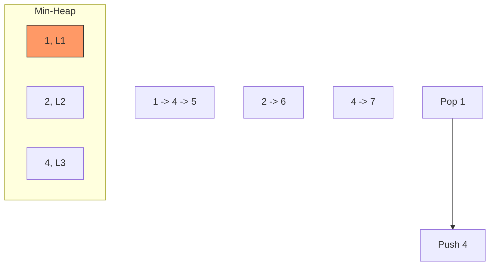

# 📶 Linked Lists: Merge K Sorted Lists

## 📝 Problem Description
[LeetCode 23](https://leetcode.com/problems/merge-k-sorted-lists/)
You are given an array of `k` linked-lists, each linked-list is sorted in ascending order. Merge all the linked-lists into one sorted linked-list and return it.

!!! info "Real-World Application"
    This problem is the core of **External Sorting**, where you have millions of rows too large to fit in memory. You sort small chunks in memory, write them to disk, and then perform a **K-way Merge** to produce the final sorted output. It's used in BigQuery and Apache Spark's shuffle-sort operations.

## 🛠️ Constraints & Edge Cases
- $0 \le k \le 10^4$
- $0 \le \text{nodes.length} \le 500$
- $-10^4 \le \text{Node.val} \le 10^4$
- The sum of `nodes.length` will not exceed $10^4$.
- **Edge Cases to Watch:**
    - `lists` is empty.
    - `lists` contains empty lists (`[[]]`).
    - One list is significantly longer than others.
    - Multiple nodes have the same value.

---

## 🧠 Approach & Intuition

!!! success "The Aha! Moment"
    Instead of merging lists one by one (which is $O(N \cdot K)$), we need a way to quickly find the "smallest of all current heads." A **Min-Heap** (Priority Queue) of size $K$ allows us to extract the global minimum and insert the next node from that same list in $O(\log K)$ time.

### 🐢 Brute Force (Naive)
Collect all nodes into an array, sort the array, and then create a new linked list. This takes $O(N \log N)$ time and $O(N)$ space, where $N$ is the total number of nodes.

### 🐇 Optimal Approach
1. Initialize a **Min-Heap**.
2. Push the head of each non-empty list into the heap (along with its list index to handle duplicate values).
3. Create a `dummy` node and a `curr` pointer.
4. While the heap is not empty:
   - Pop the smallest node.
   - Attach it to `curr.next`.
   - If the popped node has a `next` node, push that `next` node into the heap.
   - Move `curr` forward.
5. Return `dummy.next`.

### 🧩 Visual Tracing


---

## 💻 Solution Implementation

```python
(Implementation details need to be added...)
```

### ⏱️ Complexity Analysis
- **Time Complexity:** $\mathcal{O}(N \log K)$ — Each of the $N$ total nodes is pushed and popped from the heap exactly once, with each heap operation taking $\log K$ time.
- **Space Complexity:** $\mathcal{O}(K)$ — The heap stores at most one node from each of the $K$ lists at any given time.

---

## 🎤 Interview Toolkit

- **Harder Variant:** What if you cannot use extra space for a heap? (Use **Divide and Conquer** iteratively to merge pairs of lists until only one is left).
- **Scale Question:** How would you handle merging 10,000 lists from different server streams? (Use a Min-Heap with buffered input from each stream to minimize network overhead).
- **Efficiency:** Divide and Conquer also achieves $O(N \log K)$ time and can be done in $O(1)$ extra space if implemented iteratively.

## 🔗 Related Problems
- [Merge Two Sorted Lists](../merge_sorted_lists/PROBLEM.md)
- [Reverse Nodes in K Group](../reverse_nodes_in_k_group/PROBLEM.md)
- [Ugly Number II](#)
