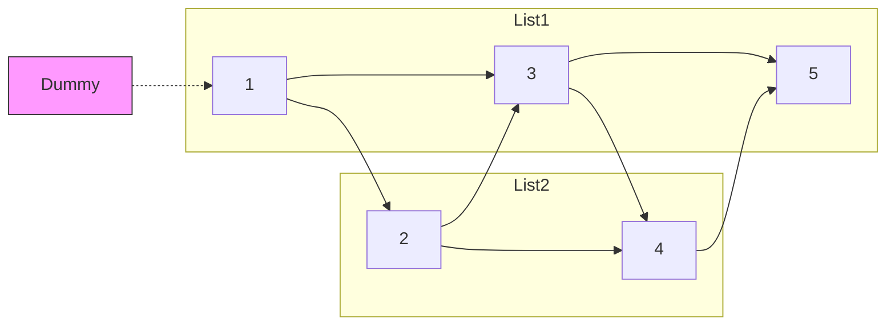

# 🔀 Linked Lists: Merge Two Sorted Lists

## 📝 Problem Description
[LeetCode 21](https://leetcode.com/problems/merge-two-sorted-lists/)
Merge two sorted linked lists and return it as a sorted list. The list should be made by splicing together the nodes of the first two lists.

!!! info "Real-World Application"
    This is the fundamental "Merge" step in the **Merge Sort** algorithm. It's also used in database engines to combine sorted result sets from different index scans or when merging sorted log files from multiple servers.

## 🛠️ Constraints & Edge Cases
- The number of nodes in both lists is in the range $[0, 50]$.
- $-100 \le Node.val \le 100$
- Both lists are sorted in non-decreasing order.
- **Edge Cases to Watch:**
    - Both lists are empty (return `None`).
    - One list is empty (return the other list).
    - Lists have different lengths.
    - Lists contain duplicate values.

---

## 🧠 Approach & Intuition

!!! success "The Aha! Moment"
    Use a **Dummy Head** node. Instead of writing complex logic to handle the initialization of the head pointer, start with a "fake" node and attach everything to it. At the end, simply return `dummy.next`.

### 🐢 Brute Force (Naive)
Creating a new list by copying all elements from both lists into an array, sorting the array, and then creating a new linked list. This takes $O(N \log N)$ time and $O(N)$ extra space, ignoring the sorted property of the input.

### 🐇 Optimal Approach
1. Create a `dummy` node to act as the starting point.
2. Maintain a `curr` pointer starting at `dummy`.
3. Compare the head nodes of `list1` and `list2`.
4. Attach the smaller node to `curr.next`.
5. Move the pointer of the chosen list and the `curr` pointer forward.
6. Repeat until one list is exhausted.
7. Attach the remaining portion of the non-empty list directly to `curr.next`.

### 🧩 Visual Tracing


---

## 💻 Solution Implementation

```python
(Implementation details need to be added...)
```

### ⏱️ Complexity Analysis
- **Time Complexity:** $\mathcal{O}(N + M)$ — We traverse each node in both lists exactly once.
- **Space Complexity:** $\mathcal{O}(1)$ — We are only re-linking existing nodes; no extra memory is used (excluding the dummy node).

---

## 🎤 Interview Toolkit

- **Harder Variant:** How would you merge $K$ sorted linked lists? (Use a Min-Heap or Divide & Conquer).
- **Scale Question:** If these lists represent sorted logs from different servers, how would you merge them into a single stream in real-time?
- **Alternative:** Can this be solved recursively? Yes, but it uses $O(N+M)$ stack space.

## 🔗 Related Problems
- [Merge K Sorted Lists](../merge_k_sorted_lists/PROBLEM.md)
- [Reorder List](../reorder_list/PROBLEM.md)
- [Reverse Linked List](../reverse_list/PROBLEM.md)
