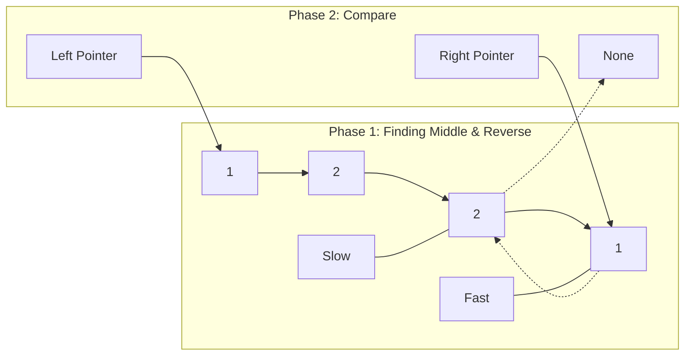

# ↔️ Linked Lists: Palindrome Linked List

## 📝 Problem Description
Given the `head` of a singly linked list, return `true` if it is a palindrome.

!!! info "Real-World Application"
    Biological sequence analysis (identifying DNA palindromic sequences), version control history comparison, and undo/redo stacks that must be reversible.

## 🛠️ Constraints & Edge Cases
- $1 \le N \le 10^5$
- $0 \le \text{Node.val} \le 9$
- **Edge Cases to Watch:**
    - **Single Node:** A single node is always a palindrome.
    - **Two Nodes:** Must have identical values (e.g., `[1, 1]`).
    - **Even vs Odd Length:** The algorithm must correctly identify the split point regardless of length parity.

---

## 🧠 Approach & Intuition

!!! success "The Aha! Moment"
    The core trick is to find the list's midpoint using **Slow and Fast Pointers**. Once we reach the middle, we **Reverse** the second half of the list. This allows us to compare values from the start and the end simultaneously using only $O(1)$ extra space.

### 🐢 Brute Force (Naive)
The simplest approach is to traverse the entire linked list and store all node values in an array. Then, use two pointers at the start and end of the array to check for a palindrome.
- **Time Complexity:** $O(N)$
- **Space Complexity:** $O(N)$ (to store the array)

### 🐇 Optimal Approach
1. **Find Middle:** Use `slow` and `fast` pointers. When `fast` reaches the end, `slow` will be at the midpoint.
2. **Reverse Second Half:** Starting from the node pointed to by `slow`, reverse the remaining list in-place.
3. **Compare:** Use two pointers—one starting at the original `head` and the other at the new head of the reversed second half. Compare values node-by-node.
4. **Restore (Best Practice):** Although usually not required by competitive programming, in real engineering, you should reverse the second half back before returning to avoid side effects.

### 🧩 Visual Tracing


---

## 💻 Solution Implementation

```python
(Implementation details need to be added...)
```

### ⏱️ Complexity Analysis
- **Time Complexity:** $\mathcal{O}(N)$ — One pass to find the middle ($N/2$), one pass to reverse the second half ($N/2$), and one pass to compare ($N/2$). Total complexity remains linear.
- **Space Complexity:** $\mathcal{O}(1)$ — We only use pointers; no additional data structures like arrays or stacks are required.

---

## 🎤 Interview Toolkit

- **The Space Trade-off:** If asked why $O(1)$ space is better than $O(N)$, mention memory-constrained environments like embedded systems or handling massive lists that might trigger swap space.
- **Modifying Input:** Always ask the interviewer if it is acceptable to modify the original list. If not, you must mention you'll restore it or use $O(N)$ space.

## 🔗 Related Problems
- `[Reverse Linked List](../reverse_list/PROBLEM.md)` — The fundamental building block for the reversal step.
- `[Linked List Cycle](../linked_list_cycle/PROBLEM.md)` — Uses the same slow/fast pointer technique for middle detection.
- `[Valid Palindrome](../../02_two_pointers/valid_palindrome/PROBLEM.md)` — The string-based version of this problem.
