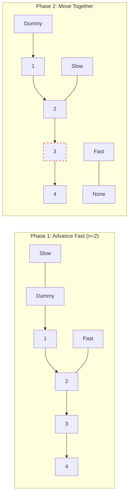

# ➖ Linked Lists: Remove Nth Node From End of List

## 📝 Problem Description
Given the `head` of a linked list, remove the `n`-th node from the end of the list and return its head.

!!! info "Real-World Application"
    Maintaining a fixed-size "Recent History" buffer in a web browser or purging the $N^{th}$ oldest item in a cache when the maximum size is reached.

## 🛠️ Constraints & Edge Cases
- $1 \le \text{Number of Nodes} \le 30$
- $0 \le \text{Node.val} \le 100$
- $1 \le n \le \text{Number of Nodes}$
- **Edge Cases to Watch:**
    - **Removing the Head:** Requires a dummy node to avoid complex `if-else` logic.
    - **Removing the Tail:** Ensure the pointer before the tail is correctly updated to `None`.
    - **Single Node List:** $n$ will be 1, resulting in an empty list.

---

## 🧠 Approach & Intuition

!!! success "The Aha! Moment"
    The challenge is that we don't know the list's length upfront. By using two pointers with a **Fixed-Gap Sliding Window**, we can find the $N^{th}$ node from the end in a **single pass**. If `fast` is $n$ steps ahead of `slow`, when `fast` reaches the end, `slow` will be exactly at the node *before* the one we want to remove.

### 🐢 Brute Force (Naive)
Perform two passes over the list.
1. **Pass 1:** Traverse the entire list to count the total number of nodes, $L$.
2. **Pass 2:** Move to the $(L - n)$ node and update its `next` pointer to skip the next node.
- **Time Complexity:** $O(2N) = O(N)$
- **Space Complexity:** $O(1)$

### 🐇 Optimal Approach
1. **Initialize:** Create a `dummy` node pointing to the `head`. Place `slow` at the `dummy` and `fast` at the `head`.
2. **Gap Creation:** Advance `fast` $n$ steps ahead.
3. **Synchronized Slide:** Move both `slow` and `fast` forward one step at a time until `fast` becomes `None`.
4. **Surgical Removal:** `slow` now points to the node preceding the target. Change `slow.next` to `slow.next.next`.
5. **Return:** Return `dummy.next` (the head of the modified list).

### 🧩 Visual Tracing


---

## 💻 Solution Implementation

```python
(Implementation details need to be added...)
```

### ⏱️ Complexity Analysis
- **Time Complexity:** $\mathcal{O}(N)$ — We traverse the list exactly once.
- **Space Complexity:** $\mathcal{O}(1)$ — We only use two extra pointers, regardless of list size.

---

## 🎤 Interview Toolkit

- **Why the Dummy Node?** It handles the edge case of removing the head node seamlessly. Without it, you'd need special logic when the head is the target.
- **One-Pass vs. Two-Pass:** While both are $O(N)$, the one-pass solution is more "elegant" and is often the expected answer in high-tier interviews.

## 🔗 Related Problems
- `[Linked List Cycle](../linked_list_cycle/PROBLEM.md)` — Uses the two-pointer (fast/slow) pattern for cycle detection.
- `[Reorder List](../reorder_list/PROBLEM.md)` — Another problem involving precise pointer manipulation.
