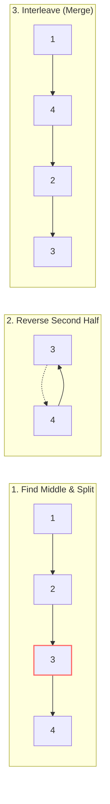

# 🔀 Linked Lists: Reorder List

## 📝 Problem Description
[LeetCode 143](https://leetcode.com/problems/reorder-list/)

You are given the head of a singly linked-list. The list can be represented as:
`L0 → L1 → … → Ln-1 → Ln`

Reorder the list to be on the following form:
`L0 → Ln → L1 → Ln-1 → L2 → Ln-2 → …`

You may not modify the values in the list's nodes. Only nodes themselves may be changed.

!!! info "Real-World Application"
    This pattern of interleaved merging is used in **Data Shuffling Algorithms** and **Memory Layout Optimization** where data needs to be rearranged for specific access patterns, such as bit-reversal in Fast Fourier Transforms (FFT) or zig-zag scans in image processing.

## 🛠️ Constraints & Edge Cases
- The number of nodes in the list is in the range $[1, 5 \times 10^3]$.
- $1 \le Node.val \le 1000$
- **Edge Cases to Watch:**
    - Single node: `[1]` → `[1]`
    - Two nodes: `[1, 2]` → `[1, 2]`
    - Three nodes: `[1, 2, 3]` → `[1, 3, 2]`

---

## 🧠 Approach & Intuition

!!! success "The Aha! Moment"
    Since we can't easily traverse a singly linked list backwards, the trick is to **Reverse the Second Half**. By splitting the list in the middle, reversing the latter part, and then weaving the two halves together, we achieve the $O(1)$ space requirement.

### 🐢 Brute Force (Naive)
The naive approach involves storing all nodes in an array/list to gain $O(1)$ random access. We then use two pointers (left and right) to relink the nodes.
- **Time Complexity:** $O(N)$
- **Space Complexity:** $O(N)$ to store the nodes.

### 🐇 Optimal Approach
The optimal solution breaks the problem into three modular steps:
1.  **Find the Middle:** Use the slow and fast pointer technique.
2.  **Reverse the Second Half:** Standard linked list reversal starting from the middle's next node.
3.  **Merge (Weave) the Lists:** Alternatingly pick nodes from the first half and the reversed second half.

### 🧩 Visual Tracing


---

## 💻 Solution Implementation

```python
(Implementation details need to be added...)
```

### ⏱️ Complexity Analysis
- **Time Complexity:** $\mathcal{O}(N)$ — We traverse the list to find the middle, then again to reverse the second half, and finally once more to merge.
- **Space Complexity:** $\mathcal{O}(1)$ — All operations are done in-place by rearranging pointers.

---

## 🎤 Interview Toolkit

- **The Cycle Risk:** Always ensure the end of the first half points to `None` after splitting, otherwise you might create an infinite loop during merging.
- **Why not Recursion?** While possible, recursion would use $O(N)$ stack space, violating the $O(1)$ space constraint often requested in interviews.

## 🔗 Related Problems
- [Remove Nth Node From End](../remove_nth_node_from_end_of_list/PROBLEM.md) — Finding nodes relative to the end.
- [Palindrome Linked List](../palindrome_linked_list/PROBLEM.md) — Uses the same split-reverse-middle technique.
- [Merge Two Sorted Lists](../merge_sorted_lists/PROBLEM.md) — Basic merging logic.
