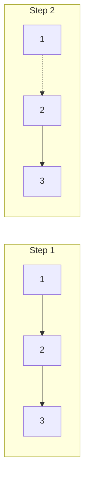

# 🔄 Linked List: Reverse Linked List

## 📝 Problem Description
Given the `head` of a singly linked list, reverse the list and return its new head.

!!! info "Real-World Application"
    Reversing a list is a fundamental operation in undo/redo functionality (if using a linked list of states) and in some network protocols where packets must be processed in reverse order.

## 🛠️ Constraints & Edge Cases
- The number of nodes in the list is in the range $[0, 5000]$.
- $-5000 \le Node.val \le 5000$
- **Edge Cases to Watch:**
    - Empty list (`head is None`).
    - Single node list.
    - Large list (ensure iterative approach to avoid stack overflow).

---

## 🧠 Approach & Intuition

!!! success "The Aha! Moment"
    Don't move the nodes—just flip the **links**. By keeping track of the previous node, we can point the current node's `next` back to it as we move forward.

### 🐢 Brute Force (Naive)
Creating a new list by prepending each element from the original list. This would take $\mathcal{O}(N)$ time but also $\mathcal{O}(N)$ space.

### 🐇 Optimal Approach (Iterative In-Place)
1. Initialize `prev` as `None` and `curr` as `head`.
2. While `curr` is not `None`:
    - Save the next node: `temp = curr.next`.
    - Reverse the link: `curr.next = prev`.
    - Advance pointers: `prev = curr`, `curr = temp`.
3. Return `prev` as the new head.

### 🧩 Visual Tracing


---

## 💻 Solution Implementation

```python
(Implementation details need to be added...)
```

### ⏱️ Complexity Analysis
- **Time Complexity:** $\mathcal{O}(N)$ — We visit each node exactly once.
- **Space Complexity:** $\mathcal{O}(1)$ — We only use three pointers regardless of list size.

---

## 🎤 Interview Toolkit

- **Recursive Approach:** Can you solve this recursively? (Hint: The stack uses $\mathcal{O}(N)$ space).
- **Sub-portion:** How would you reverse only from position $m$ to $n$?

## 🔗 Related Problems
- `[Palindrome Linked List](../palindrome_linked_list/PROBLEM.md)` — Uses reversal to check for symmetry.
- `[Reorder List](../reorder_list/PROBLEM.md)` — Uses reversal as a sub-step.
