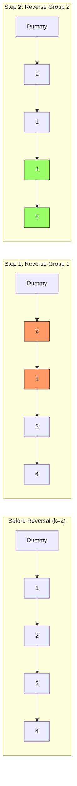

# 🔄 Linked Lists: Reverse Nodes in k-Group

## 📝 Problem Description
[LeetCode 25](https://leetcode.com/problems/reverse-nodes-in-k-group/)

Given the `head` of a linked list, reverse the nodes of the list `k` at a time, and return the modified list. `k` is a positive integer and is less than or equal to the length of the linked list. If the number of nodes is not a multiple of `k` then left-out nodes, in the end, should remain as it is.

You may not modify the values in the list's nodes. Only nodes themselves may be changed.

!!! info "Real-World Application"
    This algorithm is essential in **Batch Processing systems** where data streams are processed in fixed-size chunks. For instance, in communication protocols or file storage systems, data might be reordered or transformed in groups of `k` bytes before transmission or encryption.

## 🛠️ Constraints & Edge Cases
- The number of nodes in the list is $n$.
- $1 \le k \le n \le 5000$.
- $0 \le Node.val \le 1000$.
- **Edge Cases to Watch:**
    - $k = 1$: List remains the same.
    - $n$ is a multiple of $k$: All nodes are reversed in groups.
    - $n$ is not a multiple of $k$: The last group (less than $k$ nodes) is not reversed.

---

## 🧠 Approach & Intuition

!!! success "The Aha! Moment"
    The core challenge is maintaining the connections *between* groups after reversing the nodes *within* a group. Using a **Dummy Node** simplifies the head replacement, and a **Look-Ahead** check ensures we only reverse if at least `k` nodes are available.

### 🐢 Brute Force (Naive)
Traverse the list and store nodes in groups of `k` in an array. Reverse the array for each group and relink all nodes.
- **Time Complexity:** $O(N)$
- **Space Complexity:** $O(k)$ or $O(N)$ depending on the implementation.

### 🐇 Optimal Approach
1.  **Iterate and Count:** Use a pointer to check if there are at least `k` nodes ahead.
2.  **Reverse In-Place:** Perform a standard linked list reversal on the current group of `k` nodes.
3.  **Relink Groups:** Connect the tail of the previously processed group to the new head of the current reversed group, and connect the tail of the current group to the head of the next unprocessed group.
4.  **Repeat:** Move to the next group of `k` nodes.

### 🧩 Visual Tracing


---

## 💻 Solution Implementation

```python
(Implementation details need to be added...)
```

### ⏱️ Complexity Analysis
- **Time Complexity:** $\mathcal{O}(N)$ — We visit each node at most twice (once to count and once to reverse).
- **Space Complexity:** $\mathcal{O}(1)$ — We only use a few auxiliary pointers.

---

## 🎤 Interview Toolkit

- **Recursion vs. Iteration:** While recursion is often easier to write for this problem, it uses $O(N/k)$ stack space. Interviews frequently ask for the $O(1)$ iterative solution.
- **Node Swap Pattern:** Mastering this problem proves you can handle complex pointer manipulation, which is a key signal for seniority in technical interviews.

## 🔗 Related Problems
- [Reverse Linked List](../reverse_list/PROBLEM.md) — The fundamental primitive used here.
- [Swap Nodes in Pairs](https://leetcode.com/problems/swap-nodes-in-pairs/) — A special case where $k=2$.
- [Reorder List](../reorder_list/PROBLEM.md) — Another complex pointer manipulation problem.
