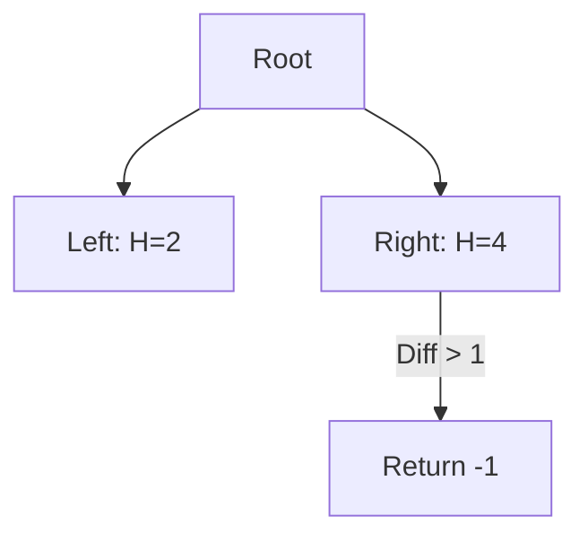

# 🌲 Tree: Balanced Binary Tree

## 📝 Description
[LeetCode 110](https://leetcode.com/problems/balanced-binary-tree/)
Given a binary tree, determine if it is height-balanced. For this problem, a height-balanced binary tree is defined as a binary tree in which the left and right subtrees of every node differ in height by no more than 1.

!!! info "Real-World Application"
    Self-balancing trees (like **AVL Trees** or **Red-Black Trees**) are used in **Database Indexing** and **OS Schedulers** to guarantee $O(\log N)$ search, insert, and delete operations.

## 🛠️ Constraints & Edge Cases
- Number of nodes is between 0 and $10^4$.
- $-1000 \le Node.val \le 1000$
- **Edge Cases to Watch:**
    - Empty tree (Balanced).
    - Single node (Balanced).
    - Skewed tree (linked list) -> Unbalanced.

---

## 🧠 Approach & Intuition

!!! success "The Aha! Moment"
    We need to check the height of every node's subtrees. Instead of calculating height from the top down (which would be $O(N^2)$), we can calculate it from the **bottom up**. If any subtree is unbalanced, we can immediately return a flag (e.g., `-1`) to propagate the failure up.

### 🐢 Brute Force (Naive)
For each node, call a `height()` function on left and right children.
- **Time Complexity:** $O(N^2)$ in worst case (skewed tree).

### 🐇 Optimal Approach
1.  Define a recursive function `dfs(node)`.
2.  **Base Case:** If node is `None`, return height `0`.
3.  **Recursive Step:**
    - `left = dfs(node.left)`
    - `right = dfs(node.right)`
4.  **Check:**
    - If `left == -1` or `right == -1` (already unbalanced), return `-1`.
    - If `abs(left - right) > 1`, return `-1`.
5.  **Return:** `1 + max(left, right)`.

### 🧩 Visual Tracing


---

## 💻 Solution Implementation

```python
(Implementation details need to be added...)
```

### ⏱️ Complexity Analysis
- **Time Complexity:** $\mathcal{O}(N)$ — We visit each node once.
- **Space Complexity:** $\mathcal{O}(H)$ — Recursion stack depth.

---

## 🎤 Interview Toolkit

- **Alternative:** Can you return `[is_balanced, height]` pair instead of using `-1` magic number? (Yes, cleaner).

## 🔗 Related Problems
- [Same Tree](../same_tree/PROBLEM.md) — Next in category
- [Diameter of Binary Tree](../diameter_of_binary_tree/PROBLEM.md) — Previous in category
