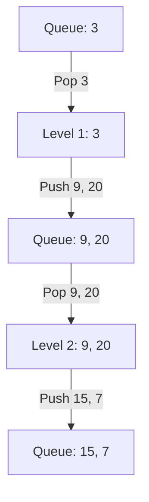

# 🌳 Tree: Binary Tree Level Order Traversal

## 📝 Description
[LeetCode 102](https://leetcode.com/problems/binary-tree-level-order-traversal/)
Given the `root` of a binary tree, return the level order traversal of its nodes' values. (i.e., from left to right, level by level).

!!! info "Real-World Application"
    This is **Breadth-First Search (BFS)**. It's used in **Social Networks** (finding friends of friends), **Web Crawlers** (visiting links layer by layer), and broadcasting in networks.

## 🛠️ Constraints & Edge Cases
- Number of nodes is between 0 and $10^4$.
- **Edge Cases to Watch:**
    - Empty tree (return `[]`).
    - Skewed tree (still processes level by level).

---

## 🧠 Approach & Intuition

!!! success "The Aha! Moment"
    We need to process nodes row by row. A **Queue** (FIFO) is perfect for this. We put the root in. Then, for every node we take out, we put its children in the back. To separate levels, we can snapshot the queue size at the start of each level loop.

### 🐢 Brute Force (Naive)
DFS with a `depth` parameter, adding to `res[depth]`. This works ($O(N)$) but isn't "level order" traversal logic, it's just organizing DFS output.

### 🐇 Optimal Approach
1.  Initialize `q` with `root`.
2.  While `q` is not empty:
    - Get `len(q)` (this is the number of nodes in the current level).
    - Iterate that many times:
        - Pop node.
        - Add value to `level_list`.
        - Add children to `q`.
    - Append `level_list` to result.

### 🧩 Visual Tracing


---

## 💻 Solution Implementation

```python
(Implementation details need to be added...)
```

### ⏱️ Complexity Analysis
- **Time Complexity:** $\mathcal{O}(N)$ — Visit every node once.
- **Space Complexity:** $\mathcal{O}(N)$ — The queue can hold up to $N/2$ nodes (leaf level).

---

## 🎤 Interview Toolkit

- **Harder Variant:** ZigZag Level Order Traversal.
- **Alternative:** Recursive DFS passing `level` index (Pre-order).

## 🔗 Related Problems
- [Binary Tree Right Side View](../binary_tree_right_side_view/PROBLEM.md) — Next in category
