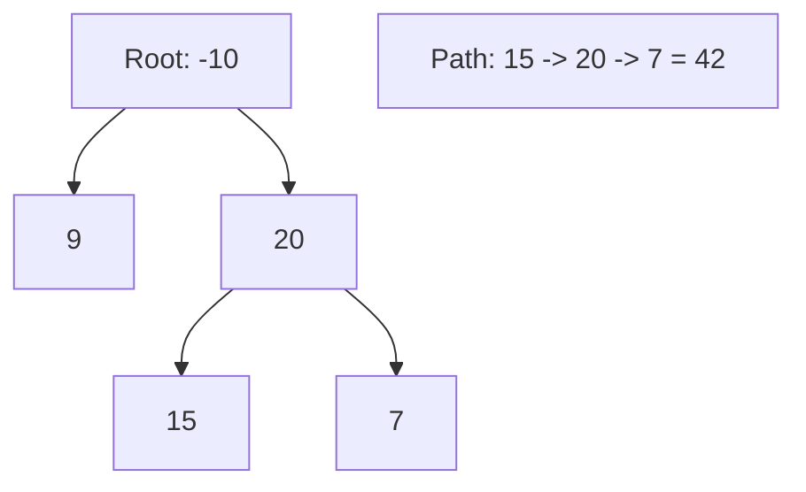

# 🌲 Tree: Binary Tree Maximum Path Sum

## 📝 Description
[LeetCode 124](https://leetcode.com/problems/binary-tree-maximum-path-sum/)
A path in a binary tree is a sequence of nodes where each pair of adjacent nodes in the sequence has an edge connecting them. A node can only appear in the sequence at most once. Note that the path does not need to pass through the root. Given the `root` of a binary tree, return the maximum path sum of any non-empty path.

!!! info "Real-World Application"
    Finding the "most valuable path" is similar to finding the **Critical Path** in project management or the path with highest bandwidth/least resistance in a network routing topology.

## 🛠️ Constraints & Edge Cases
- $-1000 \le Node.val \le 1000$
- **Edge Cases to Watch:**
    - All negative numbers (must pick the single largest node).
    - Single node.

---

## 🧠 Approach & Intuition

!!! success "The Aha! Moment"
    A path can curve! It can go up from the left child, through the node, and down to the right child. However, this "curved" path **cannot** be extended to the parent node. We need to split our logic:
    1.  **Return Value:** Max path that can be extended to parent (Node + max(Left, Right)).
    2.  **Global Update:** Check if (Left + Node + Right) is the new global max.

### 🐢 Brute Force (Naive)
Calculate all paths. Expensive and complex to track.

### 🐇 Optimal Approach
1.  Initialize global `res = -infinity`.
2.  Define `dfs(node)`:
    - Base: if `!node` return 0.
    - `leftMax = max(dfs(node.left), 0)` (Ignore negative paths).
    - `rightMax = max(dfs(node.right), 0)`.
    - **Compute Split Path:** `curr = node.val + leftMax + rightMax`.
    - Update global `res`.
    - **Return:** `node.val + max(leftMax, rightMax)`.

### 🧩 Visual Tracing


---

## 💻 Solution Implementation

```python
(Implementation details need to be added...)
```

### ⏱️ Complexity Analysis
- **Time Complexity:** $\mathcal{O}(N)$ — Visit every node.
- **Space Complexity:** $\mathcal{O}(H)$ — Recursion stack.

---

## 🎤 Interview Toolkit

- **Harder Variant:** Print the path itself.
- **Edge Case:** Handle when all nodes are negative. (Our logic `res[0]` init with `root.val` handles this, but `max(..., 0)` logic inside recursion is key).

## 🔗 Related Problems
- [Serialize and Deserialize Binary Tree](../serialize_and_deserialize_binary_tree/PROBLEM.md) — Next in category
