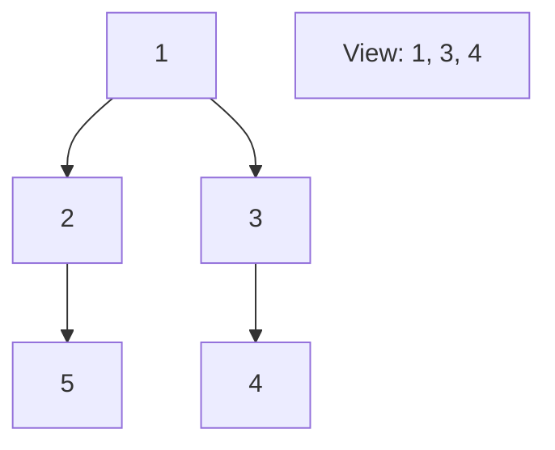

# 🌲 Tree: Binary Tree Right Side View

## 📝 Description
[LeetCode 199](https://leetcode.com/problems/binary-tree-right-side-view/)
Given the `root` of a binary tree, imagine yourself standing on the right side of it, return the values of the nodes you can see ordered from top to bottom.

!!! info "Real-World Application"
    This mimics **Occlusion Culling** in Computer Graphics (rendering a scene from a specific camera angle) or finding the "boundary" of a hierarchical structure.

## 🛠️ Constraints & Edge Cases
- Number of nodes is between 0 and $10^4$.
- **Edge Cases to Watch:**
    - Left branch is deeper/longer than right branch (must see left nodes).
    - Empty tree.

---

## 🧠 Approach & Intuition

!!! success "The Aha! Moment"
    The "right side view" is simply the **last node visited in each level** during a Level Order Traversal (BFS). Alternatively, in DFS (Root -> Right -> Left), it's the first node visited at each depth.

### 🐢 Brute Force (Naive)
BFS and store all levels, then pick the last element. Space inefficient ($O(N)$ storage for result of all levels).

### 🐇 Optimal Approach (BFS)
1.  Standard BFS with Queue.
2.  At each level iteration, identify the last node (`i == len(q) - 1`).
3.  Add it to result.

### 🧩 Visual Tracing


---

## 💻 Solution Implementation

```python
(Implementation details need to be added...)
```

### ⏱️ Complexity Analysis
- **Time Complexity:** $\mathcal{O}(N)$ — BFS visits all nodes.
- **Space Complexity:** $\mathcal{O}(D)$ — Diameter of tree (max width).

---

## 🎤 Interview Toolkit

- **Alternative:** DFS (Pre-order Root->Right->Left). Pass `level`. If `level == len(res)`, add node.

## 🔗 Related Problems
- [Count Good Nodes](../count_good_nodes_in_binary_tree/PROBLEM.md) — Next in category
- [Binary Tree Level Order Traversal](../binary_tree_level_order_traversal/PROBLEM.md) — Previous in category
