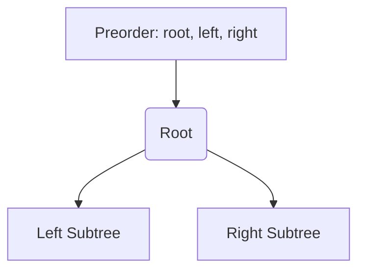

# 🌲 Tree: Construct Binary Tree from Preorder and Inorder Traversal

## 📝 Problem Description
Given two integer arrays `preorder` and `inorder` where `preorder` is the preorder traversal of a binary tree and `inorder` is the inorder traversal of the same tree, construct and return the binary tree.

!!! info "Real-World Application"
    This problem is essential in understanding data serialization and deserialization. In systems where tree structures need to be stored in databases or transmitted over networks (e.g., UI component hierarchies, syntax trees in compilers), reconstructive algorithms like this are foundational.

## 🛠️ Constraints & Edge Cases
- $0 \le \text{node.val} \le 10^4$
- The number of nodes is up to $10^4$.
- **Edge Cases to Watch:**
    - Empty trees (null arrays).
    - Single-node trees.
    - Extremely skewed trees (linear structure).

---

## 🧠 Approach & Intuition

!!! success "The Aha! Moment"
    The first element in `preorder` is always the root. Using this root, we can split the `inorder` array into two halves: left and right subtrees. A hash map allows us to find the root's position in `inorder` in $\mathcal{O}(1)$ time.

### 🐢 Brute Force (Naive)
Searching for the root in the `inorder` array takes $\mathcal{O}(N)$ for each node, leading to a total time complexity of $\mathcal{O}(N^2)$.

### 🐇 Optimal Approach
1. Pre-process the `inorder` array into a Hash Map to store `value -> index` mappings.
2. Use a recursive helper function that takes the current range of the `inorder` array.
3. The root for the current subtree is always the next available element from the `preorder` array.
4. Recursively build the left child using elements before the root's index in `inorder`.
5. Recursively build the right child using elements after the root's index.

### 🧩 Visual Tracing


---

## 💻 Solution Implementation

```python
(Implementation details need to be added...)
```

### ⏱️ Complexity Analysis
- **Time Complexity:** $\mathcal{O}(N)$ — We visit each node exactly once and map lookups are $\mathcal{O}(1)$.
- **Space Complexity:** $\mathcal{O}(N)$ — Hash map stores $N$ elements, plus $\mathcal{O}(H)$ for the recursion stack (where $H$ is the tree height).

---

## 🎤 Interview Toolkit

- **Harder Variant:** Solve it iteratively if stack depth is a concern.
- **Alternative:** What if we had Postorder and Inorder instead? (Similar logic: last element of Postorder is the root).

## 🔗 Related Problems
- [Kth Smallest in BST](../kth_smallest_element_in_bst/PROBLEM.md)
- [Max Path Sum](../binary_tree_maximum_path_sum/PROBLEM.md)
