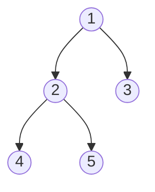

# 🌳 Trees: Diameter of Binary Tree

## 📝 Problem Description
Given the root of a binary tree, return the length of the diameter of the tree. The diameter of a binary tree is the length of the longest path between any two nodes in a tree. This path may or may not pass through the root. The length of a path between two nodes is represented by the number of edges between them.

!!! info "Real-World Application"
    Tree diameter calculations are used in network topology analysis to determine the maximum communication latency in tree-structured network topologies, and in file system path optimization.

## 🛠️ Constraints & Edge Cases
- The number of nodes in the tree is in the range $[0, 10^4]$.
- $-100 \le Node.val \le 100$.
- **Edge Cases:** 
    - Empty tree (root is None): diameter is 0.
    - Single node tree: diameter is 0.

---

## 🧠 Approach & Intuition

!!! success "The Aha! Moment"
    The diameter at any node is the sum of the depths of its left and right subtrees. We can compute the depth of each node recursively, updating a global (or nonlocal) variable to track the maximum diameter found so far.

### 🐢 Brute Force (Naive)
Calculating the diameter for every node by finding the max depth of left/right children separately results in $\mathcal{O}(N^2)$ because the depth calculation is repeated for each node.

### 🐇 Optimal Approach
Use a post-order traversal (recursive DFS) to compute the depth of each node. As we return the depth to the parent, we update the max diameter using the current node's left and right depths.

### 🧩 Visual Tracing


---

## 💻 Solution Implementation

```python
(Implementation details need to be added...)
```

### ⏱️ Complexity Analysis
- **Time Complexity:** $\mathcal{O}(N)$ — We visit each node once during the DFS.
- **Space Complexity:** $\mathcal{O}(H)$ — Where $H$ is the height of the tree (recursion stack).

---

## 🎤 Interview Toolkit

- **Harder Variant:** Find the diameter of an N-ary tree or a forest.
- **Alternative Data Structures:** Can we use BFS? It's harder, DFS is idiomatic.

## 🔗 Related Problems
- `Maximum Depth of Binary Tree` — Foundation for this problem.
