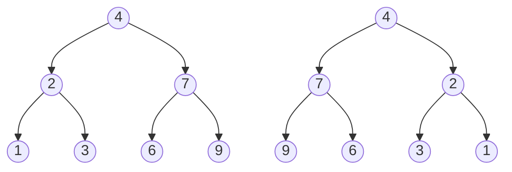

# 🌳 Trees: Invert Binary Tree

## 📝 Problem Description
Given the root of a binary tree, invert the tree, and return its root. Inverting a tree means swapping the left and right children of every node in the tree.

!!! info "Real-World Application"
    Tree inversion is a foundational operation for tree-based data manipulations, such as re-mirroring UI components or transforming expressions in compiler theory.

## 🛠️ Constraints & Edge Cases
- The number of nodes in the tree is in the range $[0, 100]$.
- $-100 \le Node.val \le 100$.
- **Edge Cases:** 
    - Empty tree (root is None): Return `None`.
    - Single node: No change required.

---

## 🧠 Approach & Intuition

!!! success "The Aha! Moment"
    A simple recursive DFS approach works: for every node, swap its left and right child pointers, then recurse on the children.

### 🐢 Brute Force (Naive)
Performing multiple passes (e.g., collect nodes in a list, then invert level-by-level) is unnecessary and inefficient.

### 🐇 Optimal Approach
Use recursive DFS (or BFS) to perform the swap in-place for each node.
1. If node is `None`, return `None`.
2. Swap `node.left` and `node.right`.
3. Recursively call `invertTree` on the left and right children.
4. Return `node`.

### 🧩 Visual Tracing


---

## 💻 Solution Implementation

```python
(Implementation details need to be added...)
```

### ⏱️ Complexity Analysis
- **Time Complexity:** $\mathcal{O}(N)$ — We visit each node once.
- **Space Complexity:** $\mathcal{O}(H)$ — Recursion stack depth.

---

## 🎤 Interview Toolkit

- **Harder Variant:** Can you do this iteratively using a queue? (BFS approach).
- **Alternative Data Structures:** Does it change if it is a Multi-way tree? Yes, you swap all children.

## 🔗 Related Problems
- `Same Tree` — Comparison based on traversal.
