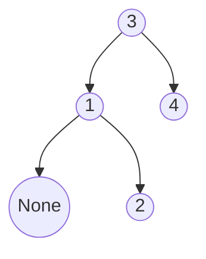

# 🌳 Trees: Kth Smallest Element in a BST

## 📝 Problem Description
Given the root of a binary search tree (BST) and an integer $k$, return the $k$-th smallest value (1-indexed) of all the values of the nodes in the tree.

!!! info "Real-World Application"
    This problem arises in database indexing where you need to retrieve the $k$-th smallest record in a sorted index structure, often used for pagination or finding percentiles.

## 🛠️ Constraints & Edge Cases
- $1 \le k \le \text{number of nodes} \le 10^4$.
- Node values are typically unique.
- **Edge Cases:** 
    - $k=1$ (smallest).
    - $k=$ number of nodes (largest).

---

## 🧠 Approach & Intuition

!!! success "The Aha! Moment"
    An in-order traversal of a BST visits nodes in strictly increasing order. We can perform an in-order traversal (left, root, right) and return the $k$-th node visited.

### 🐢 Brute Force (Naive)
Collect all node values in a list (e.g., via level-order traversal or DFS), sort the list, then return the $(k-1)$-th element. $\mathcal{O}(N \log N)$ time and $\mathcal{O}(N)$ extra space.

### 🐇 Optimal Approach
Use iterative in-order traversal with a stack.
1. Traverse left as far as possible, pushing nodes onto the stack.
2. Pop the top node, decrement $k$.
3. If $k=0$, return the popped value.
4. Set the current node to the popped node's right child and repeat.

### 🧩 Visual Tracing


---

## 💻 Solution Implementation

```python
(Implementation details need to be added...)
```

### ⏱️ Complexity Analysis
- **Time Complexity:** $\mathcal{O}(H + k)$ — Where $H$ is the tree height and $k$ is the rank we are looking for.
- **Space Complexity:** $\mathcal{O}(H)$ — To store the stack.

---

## 🎤 Interview Toolkit

- **Harder Variant:** What if the BST is modified frequently? (Need augmented trees with node-count metadata).
- **Alternative Data Structures:** Can we solve this with recursion? Yes, same logic.

## 🔗 Related Problems
- `Validate Binary Search Tree` — Basis for BST properties.
