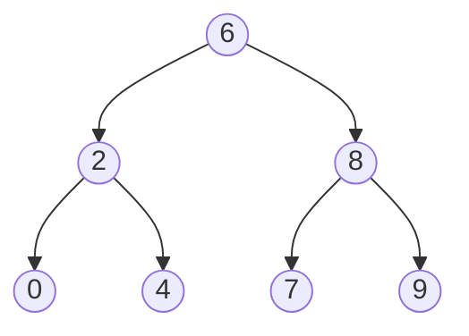

# 🌳 Trees: Lowest Common Ancestor of a BST

## 📝 Problem Description
Given a Binary Search Tree (BST) and two nodes $p$ and $q$, find the Lowest Common Ancestor (LCA) of the two nodes. The LCA is the lowest node in the tree that has both $p$ and $q$ as descendants.

!!! info "Real-World Application"
    LCA is used in Git version control to find the common ancestor of two branches, and in DOM tree manipulation for finding the common parent of two elements.

## 🛠️ Constraints & Edge Cases
- Number of nodes: $[2, 10^5]$.
- $p \neq q$.
- $p$ and $q$ exist in the BST.
- **Edge Cases:** 
    - One node is the parent of the other.
    - Nodes are at different levels.

---

## 🧠 Approach & Intuition

!!! success "The Aha! Moment"
    Exploit the BST property: for any node, all left descendants are smaller and all right descendants are larger. The LCA is the first node we encounter where the values of $p$ and $q$ "split" (one is $\le$ current, one is $\ge$ current).

### 🐢 Brute Force (Naive)
Collect paths from the root to $p$ and $q$ in lists and compare them. $\mathcal{O}(H)$ time and $\mathcal{O}(H)$ space.

### 🐇 Optimal Approach
Use the BST property to traverse downward from the root.
1. If $p.val > \text{root.val}$ and $q.val > \text{root.val}$, go right.
2. If $p.val < \text{root.val}$ and $q.val < \text{root.val}$, go left.
3. Otherwise, the current node is the LCA.

### 🧩 Visual Tracing


---

## 💻 Solution Implementation

```python
(Implementation details need to be added...)
```

### ⏱️ Complexity Analysis
- **Time Complexity:** $\mathcal{O}(H)$ — Where $H$ is the tree height.
- **Space Complexity:** $\mathcal{O}(1)$ — If implemented iteratively.

---

## 🎤 Interview Toolkit

- **Harder Variant:** What if it's a binary tree instead of BST? (Need to traverse children and return the node if found; backtracking is needed).
- **Alternative Data Structures:** Can we do this for general trees? (Yes, parent pointers help).

## 🔗 Related Problems
- `Lowest Common Ancestor of a Binary Tree` — Harder variant without BST property.
