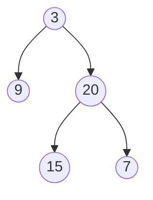

# 🌳 Trees: Maximum Depth of Binary Tree

## 📝 Problem Description
Given the root of a binary tree, return its maximum depth. The maximum depth is the number of nodes along the longest path from the root node down to the farthest leaf node.

!!! info "Real-World Application"
    Tree depth calculation is crucial for balancing self-balancing trees (AVL, Red-Black) and determining network latency in hierarchies.

## 🛠️ Constraints & Edge Cases
- Number of nodes: $[0, 10^4]$.
- Node values: $[-100, 100]$.
- **Edge Cases:** 
    - Empty tree: 0.
    - Only root: 1.

---

## 🧠 Approach & Intuition

!!! success "The Aha! Moment"
    The depth of a tree is simply `1 + max(depth(left), depth(right))`. This is a classic recursive problem.

### 🐢 Brute Force (Naive)
Performing an exhaustive search (BFS) level by level and counting levels is valid, but recursive DFS is more concise and idiomatic for this specific problem.

### 🐇 Optimal Approach
Use recursive DFS:
1. Base case: `if not root: return 0`.
2. Recursive step: `return 1 + max(self.maxDepth(root.left), self.maxDepth(root.right))`.

### 🧩 Visual Tracing


---

## 💻 Solution Implementation

```python
(Implementation details need to be added...)
```

### ⏱️ Complexity Analysis
- **Time Complexity:** $\mathcal{O}(N)$ — Where $N$ is the number of nodes (we visit each node exactly once).
- **Space Complexity:** $\mathcal{O}(H)$ — Where $H$ is the tree height (recursion stack space).

---

## 🎤 Interview Toolkit

- **Harder Variant:** Minimum depth of binary tree? (Requires BFS, stopping at the first leaf node).
- **Alternative Data Structures:** Can we do this iteratively using BFS? (Yes, use a queue and a level counter).

## 🔗 Related Problems
- `Diameter of Binary Tree` — Extension of depth calculation.
- `Balanced Binary Tree` — Checks depth difference.
