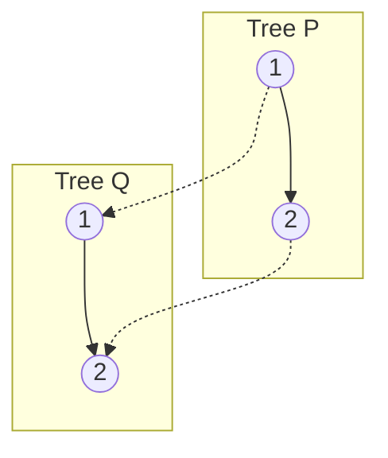

# 🌲 Trees: Same Tree

## 📝 Problem Description
Given the roots of two binary trees `p` and `q`, write a function to determine if they are the same or not. Two binary trees are considered the same if they are structurally identical, and the nodes have the same value.

!!! info "Real-World Application"
    Tree comparison is used in **DOM reconciliation** in frameworks like React (Virtual DOM diffing) and in **version control systems** (Git) to compare directory structures represented as trees.

## 🛠️ Constraints & Edge Cases
- Number of nodes in both trees is in the range $[0, 100]$.
- $-10^4 \le Node.val \le 10^4$.
- **Edge Cases to Watch:**
    - Both trees are empty (True).
    - One tree is empty, the other is not (False).
    - Structurally different trees with identical values (False).

---

## 🧠 Approach & Intuition

!!! success "The Aha! Moment"
    Structural equality is recursive. Two trees are identical if and only if their roots match, their left subtrees are identical, and their right subtrees are identical.

### 🐢 Brute Force (Naive)
Converting trees to serial strings (e.g., using preorder traversal including `None`) and comparing the strings. While conceptually simple, it takes $O(N)$ space and time, plus extra overhead for serialization.

### 🐇 Optimal Approach
Use recursive DFS to compare nodes in tandem.
1. If both are `None`, return `True`.
2. If only one is `None` or values differ, return `False`.
3. Recursively return `isSame(p.left, q.left) and isSame(p.right, q.right)`.

### 🧩 Visual Tracing


---

## 💻 Solution Implementation

```python
(Implementation details need to be added...)
```

### ⏱️ Complexity Analysis
- **Time Complexity:** $\mathcal{O}(N)$ — We visit each node in both trees exactly once.
- **Space Complexity:** $\mathcal{O}(H)$ — Where $H$ is the height of the tree, representing the recursion stack.

---

## 🎤 Interview Toolkit

- **Harder Variant:** Solve iteratively using a queue (BFS) to compare trees level by level.
- **Alternative Data Structures:** Serialize trees into canonical forms (e.g., Merkle trees) for rapid hash comparison in distributed systems.

## 🔗 Related Problems
- [Subtree of Another Tree](../subtree_of_another_tree/PROBLEM.md) — Determining if one tree exists inside another.
- [Balanced Binary Tree](../balanced_binary_tree/PROBLEM.md) — Checking structural properties.
