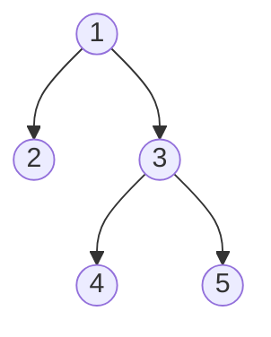

# 🌲 Trees: Serialize and Deserialize Binary Tree

## 📝 Problem Description
Serialization is the process of converting a data structure or object into a sequence of bits so that it can be stored in a file or memory buffer, or transmitted across a network connection link to be reconstructed later. Design an algorithm to serialize and deserialize a binary tree.

!!! info "Real-World Application"
    This is core to **Data Marshaling**, used in JSON/XML serialization, saving game states (object persistence), and transmitting complex object graphs in distributed systems (RPC calls like gRPC).

## 🛠️ Constraints & Edge Cases
- Number of nodes in the tree is in the range $[0, 10^4]$.
- $-1000 \le Node.val \le 1000$.
- **Edge Cases to Watch:**
    - Empty tree (should serialize to "N").
    - Single node tree.
    - Extremely skewed tree (ensure recursion depth is managed or handled).

---

## 🧠 Approach & Intuition

!!! success "The Aha! Moment"
    A simple traversal is not enough; you must explicitly store "sentinel" values for `None` children. By recording every `None` as "N" in a preorder traversal, the structure is uniquely recoverable.

### 🐢 Brute Force (Naive)
Storing nodes as an array using Level Order (BFS) is possible, but managing null pointers and trailing nulls becomes complex and often inefficient for space if the tree is sparse.

### 🐇 Optimal Approach
Use recursive DFS (preorder) to build a string:
1. **Serialize:** If node exists, add `str(val) + ","`. If null, add `N,`.
2. **Deserialize:** Split by comma, use an iterator/pointer to traverse the list, and reconstruct nodes recursively.

### 🧩 Visual Tracing


---

## 💻 Solution Implementation

```python
(Implementation details need to be added...)
```

### ⏱️ Complexity Analysis
- **Time Complexity:** $\mathcal{O}(N)$ — Each node is visited once during both serialization and deserialization.
- **Space Complexity:** $\mathcal{O}(N)$ — To store the serialized string (or list of tokens) and the recursion stack.

---

## 🎤 Interview Toolkit

- **Harder Variant:** Solve using Level-Order Traversal (BFS) to avoid potential stack overflow on extremely deep/skewed trees.
- **Scale Question:** For massive trees, consider using binary serialization or protobufs instead of plain text strings to reduce network/disk usage.

## 🔗 Related Problems
- [Same Tree](../same_tree/PROBLEM.md) — Comparison of trees.
- [Binary Tree Maximum Path Sum](../binary_tree_maximum_path_sum/PROBLEM.md) — Complex tree recursion.
