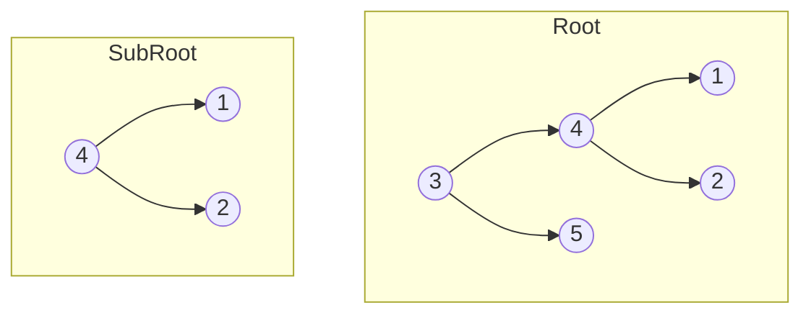

# 🌲 Trees: Subtree of Another Tree

## 📝 Problem Description
Given the roots of two binary trees `root` and `subRoot`, return `true` if there is a subtree of `root` with the same structure and node values as `subRoot` and `false` otherwise.

!!! info "Real-World Application"
    Tree pattern matching is frequently used in **compiler construction** (matching AST structures) and in **XML/JSON querying** where you look for a specific schema or sub-fragment within a larger document.

## 🛠️ Constraints & Edge Cases
- Number of nodes in `root` is in $[1, 2000]$.
- Number of nodes in `subRoot` is in $[1, 1000]$.
- $-10^4 \le Node.val \le 10^4$.
- **Edge Cases to Watch:**
    - `subRoot` is null (technically a subtree).
    - `root` is null, `subRoot` is not (cannot contain it).

---

## 🧠 Approach & Intuition

!!! success "The Aha! Moment"
    A tree `A` contains `B` as a subtree if: `A` matches `B`, OR `A.left` contains `B`, OR `A.right` contains `B`.

### 🐢 Brute Force (Naive)
At every node in `root`, perform a structural comparison (like `isSameTree`). This leads to $\mathcal{O}(N \cdot M)$ complexity.

### 🐇 Optimal Approach
For small constraints, the recursive comparison is standard. For massive trees, we could use Merkle hashing or serialized string matching to reduce to $\mathcal{O}(N+M)$.

### 🧩 Visual Tracing


---

## 💻 Solution Implementation

```python
(Implementation details need to be added...)
```

### ⏱️ Complexity Analysis
- **Time Complexity:** $\mathcal{O}(N \cdot M)$ — Where $N$ is nodes in `root` and $M$ is nodes in `subRoot`. We potentially traverse $M$ nodes for each of $N$ nodes.
- **Space Complexity:** $\mathcal{O}(H)$ — Recursion depth.

---

## 🎤 Interview Toolkit

- **Harder Variant:** Optimize to $\mathcal{O}(N+M)$ using serialization or Merkle trees.
- **Scale Question:** What if the trees are too large for memory? (Use stream-based traversal or disk-backed structures).

## 🔗 Related Problems
- [Same Tree](../same_tree/PROBLEM.md) — The fundamental helper function.
- [Lowest Common Ancestor of BST](../lowest_common_ancestor_bst/PROBLEM.md) — Tree traversal logic.
