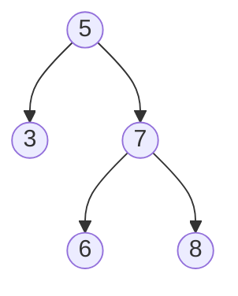

# 🌲 Trees: Validate Binary Search Tree

## 📝 Problem Description
Given the `root` of a binary tree, determine if it is a valid binary search tree (BST). A valid BST satisfies:
- Left subtree nodes < node's key.
- Right subtree nodes > node's key.
- Both subtrees are also valid BSTs.

!!! info "Real-World Application"
    This is fundamental to **indexing structures** (databases/file systems) where efficient range queries are required. Data must be maintained in a strictly sorted structure to ensure $\mathcal{O}(\log N)$ lookups.

## 🛠️ Constraints & Edge Cases
- Number of nodes in the tree is in $[1, 10^4]$.
- $-2^{31} \le Node.val \le 2^{31} - 1$.
- **Edge Cases to Watch:**
    - Empty tree (Valid).
    - Single node (Valid).
    - Nodes with equal values (Invalid, unless specifically defined differently, standard BST requires strict inequality).
    - Skewed trees violating ranges (e.g., node on right is smaller than root).

---

## 🧠 Approach & Intuition

!!! success "The Aha! Moment"
    A local check ($Left < Node < Right$) is insufficient. You must maintain a **valid range** $(min, max)$ that propagates down as you traverse the tree.

### 🐢 Brute Force (Naive)
Perform an In-order traversal and verify that the resulting array is strictly sorted. This takes $\mathcal{O}(N)$ extra space to store the array and $\mathcal{O}(N)$ time.

### 🐇 Optimal Approach
Use recursive DFS with boundary conditions:
1. Initialize with $(-\infty, +\infty)$.
2. Left recursion: new range $(min, node.val)$.
3. Right recursion: new range $(node.val, max)$.
4. Validate `min < node.val < max` at each step.

### 🧩 Visual Tracing


---

## 💻 Solution Implementation

```python
(Implementation details need to be added...)
```

### ⏱️ Complexity Analysis
- **Time Complexity:** $\mathcal{O}(N)$ — We visit each node exactly once.
- **Space Complexity:** $\mathcal{O}(H)$ — Where $H$ is the tree height, due to the recursion stack.

---

## 🎤 Interview Toolkit

- **Harder Variant:** Solve iteratively using an explicit stack.
- **Alternative Data Structures:** In-order traversal is essentially a sorted list; this problem is equivalent to "is the in-order traversal of this tree strictly increasing?"

## 🔗 Related Problems
- [Kth Smallest Element in a BST](../kth_smallest_element_in_bst/PROBLEM.md) — Leveraging BST properties.
- [Same Tree](../same_tree/PROBLEM.md) — Fundamental tree comparisons.
