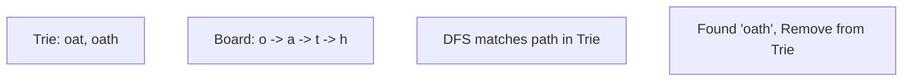

# 🔎 Trie: Word Search II

## 📝 Description
[LeetCode 212](https://leetcode.com/problems/word-search-ii/)
Given an `m x n` `board` of characters and a list of strings `words`, return all words on the board. Each word must be constructed from letters of sequentially adjacent cells, where adjacent cells are horizontally or vertically neighboring. The same letter cell may not be used more than once in a word.

!!! info "Real-World Application"
    Core logic for **Boggle** solvers, **Scrabble** AI, or searching for multiple **DNA Motifs** in a grid sequence.

## 🛠️ Constraints & Edge Cases
- $1 \le m, n \le 12$
- $1 \le words.length \le 3 \cdot 10^4$
- **Edge Cases to Watch:**
    - Words sharing prefixes (e.g., "oath", "oaths").
    - Same word appearing multiple times in board (result should be unique).

---

## 🧠 Approach & Intuition

!!! success "The Aha! Moment"
    Instead of searching the board for *each* word ($O(W \cdot M \cdot N)$), we can put all words into a **Trie** and scan the board *once*. As we DFS on the board, we traverse the Trie. If we hit a leaf in the Trie, we found a word!

### 🐢 Brute Force (Naive)
Run "Word Search I" for every single word.
- **Time Complexity:** Very high overhead due to repeated board scans.

### 🐇 Optimal Approach
1.  **Build Trie:** Insert all words. Store the full word at the end node.
2.  **DFS Board:** From each cell `(r, c)`, start DFS if `board[r][c]` exists in Trie root.
3.  **Traverse:**
    - Move to Trie child.
    - Mark board cell visited (`#`).
    - Check neighbors.
    - **Optimization:** If we find a word, remove it from Trie (pruning) to avoid duplicates and re-finding.
    - Backtrack.

### 🧩 Visual Tracing


---

## 💻 Solution Implementation

```python
(Implementation details need to be added...)
```

### ⏱️ Complexity Analysis
- **Time Complexity:** $\mathcal{O}(M \cdot N \cdot 4^L)$ — Bounded by board size and word length.
- **Space Complexity:** $\mathcal{O}(TotalChars)$ — Trie size.

---

## 🎤 Interview Toolkit

- **Optimization:** Discuss "Pruning" the Trie. If a branch has no more words, remove it so DFS returns early.

## 🔗 Related Problems
- [Design Add and Search Words](../design_add_and_search_words_data_structure/PROBLEM.md) — Previous in category
